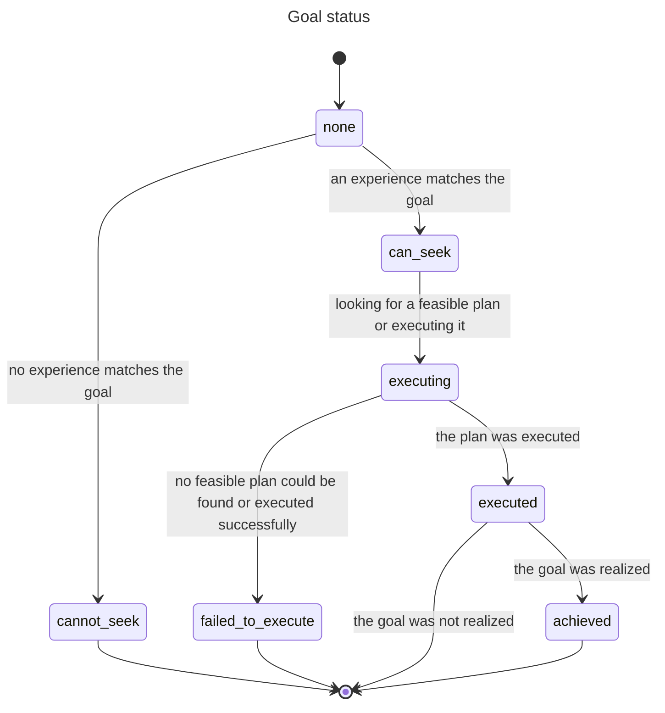

# Acting

A Cognition Actor (CA) acts by giving itself or being given goals, by finding plans that might achieve some or all of the goals, and by executing the plans.

## About Cognition Actors

The mind of a robot is a collective of CAs organizing themselves into an abstraction hierarchy as the robot learns how to survive.

Each Cognition Actor (CA) observes what lower-level CAs making up its umwelt experience. The CA aggregates and integrates these observations into its own experiences and assigns a feeling to each one based on how wellbeing fluctuates.

A CA acts to improve how it feels by achieving goals of terminating bad experiences and persisting good ones. A CA gives itself goals and delegates goals to its umwelt. It finds plans and executes them. The CA eventually decides whether the execution of a plan achieved its goal, or whether a goal or plan has become stale and should be abandoned.

## Definitions

A **goal** is a relation/property, observed or experienced, that a CA aims to impact in a certain way.

An *intent* is a self-assigned goal to impact one of its own felt experiences.

A *directive* is a goal delegated by a CA to its umwelt CAs requesting that they impact experiences that the CA observed them having.

A **plan** is a prioritized set of directives designed by a CA and sent to its umwelt CAs to achieve either its own intent or a directive it received.

An *affordance* is a plan with an effectiveness score justifying its reuse.

Note that the only two "ground" concepts are `goal` and `plan`; `intent`, `directive` and `affordance` are perspectives on goals and plans.

## How Cognition Actors act

Acting happens at specific phases of the CA's lifecycle.

The CA repeats this lifecyle in a loop for as long as it persists. CAs higher up the hierarchy have longer lifecycles than lower-down CAs, which provides room for sub-plans to execute and realize higher-level plans that spawned them.

The lifecycle of a CA consists of these repeating phases constituting the equivalent of an OODA loop:

`predict` -> `observe` -> `experience` -> `feel` -> `act` -> `assess` -> (and back to `predict`)

The phases `act` and `assess` are involved in setting goals, making and prioritizing plans, executing plans, and reviewing the success of extant goals and plans.

Achieving a goal and the planned sub-goals it depends on requires coordination between a parent CA and its umwelt CAs. Coordination happens via the exchange of messages.

During any phase of its lifecycle, a CA receives events and messages. Events are multicated by a CA to its umwelt CAs whereas umwelt CAs send messages to their parent CAs.

### Action phases

During the `act` phase, a CA:

* Updates what it curently considers to be its most urgent intent
  * but only if no intent is already progressing toward being executed
* Advances toward completion, as priority dictates, the statuses
  * of its own intent
  * of directives in plans it received from parent CAs
  
At the `assess` phase, a CA:

* Determines if its intent is stale
  * If so, it abandons it and lets its umwelt know
* Determines the success or failure of previously executed plans
  * If successful, it gives a score to executed plans built by the CA, perhaps making them affordances

### Communication

#### From parent to umwelt

`todo([Directive, ...])`

* For each directive,
  * if not relevant to the umwelt CA, respond to parent with `cannot_seek(Directive)`
  * if relevant, respond with `can_seek(Directive)`

`execute(Directive, PlanId)`

* Search for a feasible plan for the directive
* If plan **not** found
  * send back `failed_to_execute(Directive)`
* Else
  * retain the directive (associating it with a parent's plan)
  * execute the plan for it

`abandon(PlanId)`

* Forget all directives associated with the parent's plan

#### From umwelt to parent

`can_seek(Directive)`

* Sent if the directive is relevant to the umwelt CA

`cannot_seek(Directive)`

* Sent if the directive is not relevant to the umwelt CA

`executed(Directive)`

* Sent when the umwelt CA's plan for the directive completed execution successfully

`failed_to_execute(Directive)`

* Sent when the umwelt CA's plan for the directive failed to complete execution

#### When umwelt CAs are effector CAs (level 0)

A parent CA's plan (at level 1) are composite actions (e.g. [left_wheel:spin, left_wheel:spin, right_wheel:reverse_spin]) known to be meaningful to its umwelt.

Being composite actions, plans are execute at once instead of as a sequence of directives. Execution always succeeds.

`ready_actions([Action, ...], PlanId)`

* Sent to each umwelt CA who then prepares the body to execute the relevant actions

### Searching for a feasible plan to achieve a goal

* Construct a plan that might achieve the goal
  * Submit it as `todo([Directive, ...])` to the umwelt for consideration
* Wait for confirmation that all its directives can be sought, confirmed by `can_seek(Directive)`(feasible)
  * or for a directive that can't be sought by the entire umwelt, confirmed by `cannot_seek(Directive)` (not feasible)
* If feasible, execute it
  * If execution failed for any of the plan's directives
    * search for another feasible plan and execute it
* If not feasible,
  * search for another plan
* If no feasible plan can be found
  * send back `execution_failed(Directive)`
* If replacing an intent that is not yet executed,
  * tell the umwelt to `abandon(Directive)` for each the directive associated with the intent's plan

### Executing a plan to achieve a goal

* If CA level > 1
  * Select the next ready directive in the plan
  * Select an umwelt CA who can seek to achieve the directive
  * Send it `execute(Directive, PlanId)`
  * If `execute_failed(Directive)` is received
    * select another umwelt CA that can_seek it and tell it to execute it
    * if none left and the plan's goal was a directive
      * send `failed_to_execute(Directive)` to the parent who sent the goal
  * If all directives in the plan were executed and if the plan's goal was a directive
    * send `executed(Directive)` to parent who sent the directive
* If level 1 - a plan for a directive is a single act composed of actions to be taken all at once
  * send static umwelt `ready_actions([Action, ...])`
  * call `body:execute`
  * send `executed(Directive)` to parent who sent the directive

## Action-related state

Each CA independently manages its own changing state. The data composing this state captures, in the current and in remembered timeframes, what the CA has observed, experienced, felt etc. as well as its goals, plans and their progress.
  
### Goal status

The status of a goal indicates where it is in its progression toward, hopefully, being achieved, including the possibility of reaching a dead end.

The possible statuses are:

* `none` - no progress yet
* `can_seek` - the goal was found to relate to one or more experiences of the CA
* `cannot_seek` - the goal does not relate to any experience
* `executing` - working on finding and executing a plan to achieve the goal
* `executed` - the plan for the goal was executed
* `failed_to_execute` - no plan can be found that could be successfully executed
* `achieved` - the goal was achieved

  
### Relevant state properties

The state of the CA consist of many properties, including the following it uses to manage its actions:

* `intent`- `goal{...}` - The CA's current intent
* `plans` - [`plan{...}`, ...] - All the plans built to achieve the intent and directives to execute
* `goal_states` - [`goal_state{...}`, ...] - The statuses of the CA's intent and of directives the CA received and sent, as well as messages it received that caused the status changes and messages it sent to report them

### Data structures

How goals, plans and goal states are encoded as data:

#### `goal{id: ID, target: Target, impact: Impact}`

> ID: A goal's ID is fully determined by Target and Impact - two goals in different plans will have the same ID if they are semantically the same
>
> Target: `target{origin: Origin, kind: Kind, value: Value}` - the state of a property or relation
>
> Impact: `create` | `persist` | `terminate`

#### `plan{id: ID, goal: GoalID, directives: [goal{...}, ...], , priority: Priority, score: Score, by: CA_ID}`

> ID: A unique id for the plan. No two plans have the same id.
>
> GoalID: The id of the goal this plan is for
>
> Priority: 0.0..1.0 - How important is this plan to the CA that sent it out
>
> Score: 0.0..1.0 | none - Score is always none for plans received (it is up to the sender to score them)
>
> CA_ID: The id of the CA that built the plan (can be the CA if for its intent, or a parent CA)

#### `goal_state{goal: GoalID, status: Status, messages: [GoalMessage, ...]}`

> GoalID: The id of the goal - Note that multiple plans might unknowingly contain the same goal
>
> Status: `none` | `can_seek` | `cannot_seek` | `executing` | `failed_to_execute` | `executed` | `achieved`
>
> GoalMessage - A message received or sent about the goal, latest first. A received message can cause the status of a goal to change, a sent message communicates that change.
