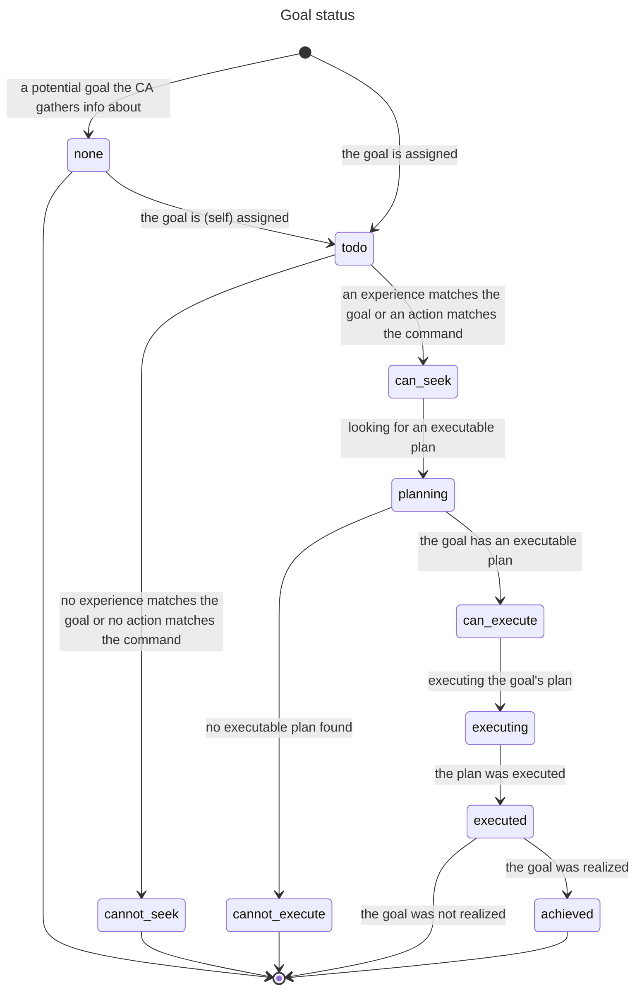
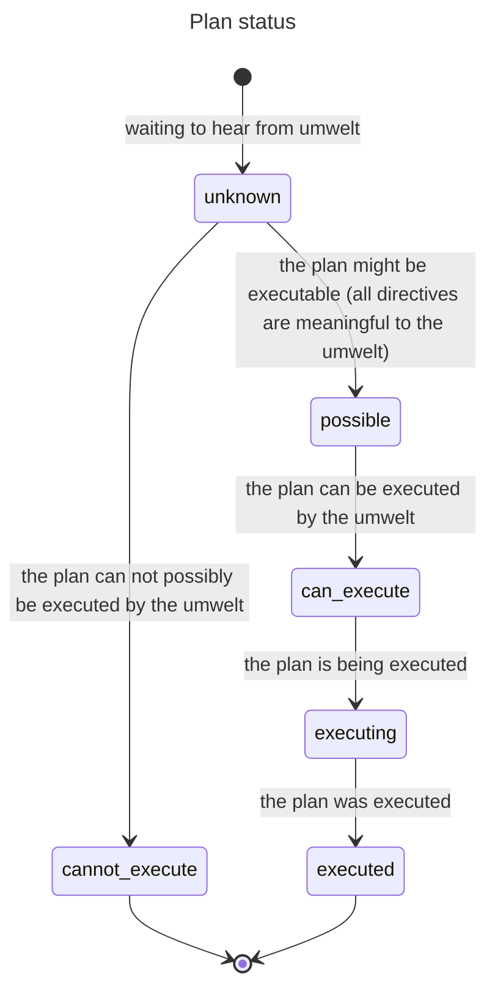

# Acting

## How Cognition Actors act

The mind of a robot is a collective of Cognition Actors (CAs) organizing themselves into an abstraction hierarchy as the robot learns how to survive.

Each Cognition Actor (CA) observes what lower-level CAs making up its umwelt are experiencing. The CA aggregates and integrates these observations into its own experiences and assigns a feeling to each one based on how its wellbeing fluctuates.

A CA acts to improve how it feels by intending to terminate bad experiences and persist good ones. Over its lifetime, a CA gives itself such goals (its intents) and, to achieve them, takes action. It delegates sub-goals (directives) to its umwelt, or, if a low-level CA, one with effector CAs in its umwelt, it issues direct commands (spin your wheel, etc.).

A CA (other than an effector CA) finds plans to achieve goals and executes them. The CA eventually decides whether the execution of a plan achieved its intended goal, or whether a goal or plan has become stale and should be abandoned.

So, a Cognition Actor (CA) acts by giving itself a goal (its intent) and by being assigned goals (directives), and then finding plans that might achieve some or all of them, and by executing these plans.

A CA with an intent triggers the recursive, stepwise execution of a plan to achieve the intent, as soon as the plan is (transitively) ready to execute.

A CA initiates actions by:

1. Giving itself an intent and assigning it a priority
2. Finding a workable plan for it to be carried out by its umwelt (with its sub-plans etc. down to effector actions)
3. Executing it (stepwise and recursively via sub-plans,  down to effector actions)

An executable plan is found by a CA only when, for each of the plan's directives (goals or commands), executable plans are found by the CA's umwelt to achieve each of the goals, or the umwelt contains effector CAs capable of carrying out each of the commands.

At any point in time, there may be multiple CAs attempting to achieve their own intents. These attempts may get in each other's way. Such conflicts are minimized, if not resolved, by executing plans according to precedence. Precedence is determined by the hierarchical level of the owner of the causal intent (higher-ups matter more) and by the priority assigned to the achievement of the intent.

## Definitions

A **goal** is a relation/property experienced by the CA or its umwelt to be initiated, persisted or terminated.

An *intent* is a self-assigned goal of the CA to impact a felt experience it has.

A *directive* is a either a command to directly cause an action, or a goal delegated by a CA to its umwelt CAs for them to achieve individually (by indirectly causing actions) however they see fit.

A *command* is an action (spin the wheel, reverse-spin the wheel, etc.) requested of an effector CA.

A *plan* is a prioritized set of directives assembled by a CA and sent to its umwelt CAs to achieve either its own intent or a directive it received from a parent CA.

An *affordance* is a pre-built plan with an effectiveness score informing its reuse.

Note that the only "ground" concepts here are `command`, `goal` and `plan`; `intent`, `directive` and `affordance` are "perspectives" on them.

## Acting and the CA lifecycle

Acting happens at specific phases of a CA's lifecycle.

The CA repeats its lifecyle in a loop for as long as it survives. CAs higher up the hierarchy have longer lifecycles than lower-down CAs, which provides room for sub-plans to execute and to realize the higher-level goals that spawned them.

The lifecycle of a CA consists of these repeating **phases** constituting the equivalent of an OODA loop:

`predict` -> `observe` -> `experience` -> `feel` -> `act` -> `assess` -> (and back to `predict`)

The `act` phase is responsible for setting goals, making and prioritizing plans, and executing them. The `assess` phase is responsible, in part, for reviewing the success of extant goals and plans and possibly dropping some.

Achieving a goal and the planned sub-goals it depends on requires coordination between a parent CA and its umwelt CAs, all opf which are separate processes.
During any phase of its lifecycle, a CA receives events and messages regarding the status of goals and plans.
An event is multicasted by a CA to its umwelt or parent CAs, whereas a message targets a single CA.

### Phases and acting

During the `act` phase, a CA:

* Gives itself an intent and assigns it a priority
  * but only if no intent is already progressing toward being executed
* Advances goals (its intent or directives it received) toward completion by building and executing plans, as urgency dictates
  
At the `assess` phase, a CA:

* Determines if its intent is stale
  * If so, the CA abandons it and lets its umwelt know so they can stop trying to achieve it
* Determines the success or failure of previously executed plans
  * Each built and executed by the CA is given a score (or its score is updated) from an assessment of its success, making it a more or less attractive affordance

### Communications

A directive (goal or command sent or received) is communicated by value or by reference.
It is communicated by reference when the target of the communication is fully expected to know of the referenced directive.
A directive is communicated by value to parents because some parents may not yet have been requested to do it but might later.
An intent (self-assigned goal) is always communicated by reference (an umwelt CA does not need to know the nature of the intents of its ancestors, only their identifier).

CAs always communicate about directives with umwelt CAs via events so as to reach all umwelt CAs.
Umwelt CAs also always communicate about directives with parents via events (multicasts), so they all update goal states for directives they have sent or might send.

#### Broadcasts from parent to umwelt

##### Event `todo([directives=[Directive, ...]])`

A CA wants to know if its umwelt could potentially execute the sequence of directives of a plan it constructed.
The event is received by all CAs in the umwelt of the broadcasting CA.

* For each directive,
  * if not relevant to the umwelt CA, it broadcasts back `cannot_seek(Directive)` to all parents
  * if relevant, it broadcasts back `can_seek(Directive)`

##### Event `find_plan([directive_id=DirectiveId])`

Once it has received feedback from (enough) of its umwelt about a plan it built and disseminated to know it might be executable, a CA asks its umwelt CAs to construct, with some priority, a plan to achieve each directive from its own plan, in the context of an intent (its own or that of an ancestor CA).

Only the umwelt CAs who `can_seek` a directive works on a plan for it. The others ignore the broadcasted request.
The plan can be executed only if there is, transitively, an executable umwelt plan for each of its directives.

If the directive is a goal, umwelt CAs must come up with their own plans to realize the directive
If the directive is a command, an effector CA need only reply that it can execute the command if it is capabale of realizing the requested action; no actual planning is ever done by effector CAs.

* If an executable plan is found for a directive received by a CA (it was trivially found if the directive is a command, else planning work was required)
  * the CA holds on to it with its association with the goal is it meant to achieve
  * and broadcasts to its parents that it `can_execute([directive=Directive])`
* If an executable plan can **not** be found
  * the receiving CA broadcasts to its parents that it `cannot_execute([directive=Directive])`

##### Event `execute([directive_id=DirectiveId])`

Once CA knows a plan it built is executable, the CA asks its umwelt CAs to execute each of its directives in turn.
This means executing any plan they found for each of the directives in the CA's plan.

Upon receiving an `execute` event for a directive, a CA reacts as follows:

* If an effector CA and the command is meaningful to it,
  * It readies the body for actuation of the action in the command to execute
* If not an effector CA and the CA has an executable plan for the directive
  * If the plan is a sequence of commands,
    * tell the effector CAs one level below to execute all planned commands (they ready the body to execute at once the commanded actions)
    * and then tell the body to execute the readied actuations at once
  * Else
    * For each (sub) directive in the plan the CA built for the directive to execute
      * Tell its umwelt CAs to execute any executable plan they have for the sub-directive (it could get messy if there's more than one)
      * Wait for a confirmation event (`executed([[directive_id=DirectiveId])`) that the sub-directive was (tranistively) executed in the umwelt
  * Send the parent CA confirmation event that the plan for the received directive was executed

See -Executing a Plan-.

##### Event `abandoned([intent_id=IntentId])`

A CA tells its *transitive* umwelt to forget about all directives received and plans conceived in the context of an intent from an ancestor CA.

##### Event `intent_completed([intent_id=IntentId])`

A CA tells its *transitive* umwelt that a plan it built to achieve its intent was executed.
This is of interest if some state cleanup is needed by the transitive umwelt.

#### Broadcasts from umwelt to parent(s)

##### Event `can_seek([directive=Directive])`

A CA tells its parent CAs, in response to a parent broadcasting `todo` directives to its umwelt, that it might be able to impact a given goal (it refers to one of its experiences) or to run the command (it can do the action).

##### Event `cannot_seek([directive=Directive])`

A CA tells its parent CAs, in response to a parent broadcasting `todo` directives to its umwelt, that a given directive is not recognized, i.e. the goal does **not** refer to one of its experiences, or the command's action is not in its repertoire.

##### Event `can_execute([directive=Directive])`

A CA tells its parent CAs, in response to a `find_plan` event broadcasted a parent, that it successfully built such a transitively (all the way down to actions) executable plan for a directive it received. If it received a command for an action it can do, the plan being trivially the command itself, the (effector) CA can execute it.

See -Searching for a plan-.

##### Event `cannot_execute([directive=Directive])`

A CA tells its parent CAs, in response to a `find_plan` event sent to it by a parent, that it failed to build a plan for a directive it received.

See -Searching for a plan-

##### Event `executed([directive_id=DirectiveId])`

A CA tells its parent CAs, in response to an `execute` event broadcasted by a parent, that it executed the plan it had constructed for the goal, or readied the body for actuating the command.

See -Executing a Plan-.

### Searching for an executable plan to achieve a goal

When the CA has given itself an intent or has received a directive to achieve an intent by some ancestor, it:

* Constructs a plan, one that might achieve the goal
  * and submits it as `todo([Directive, ...])` to the umwelt for feedback
* Waits for affirmation or negation of relevance from all umwelt CAs (`can_seek(Directive)` and`cannot_seek(Directive)`)
* If at least one directive in the plan is irrelevant to *all* umwelt CAs
  * the plan cannot execute
  * it sends back `cannot_execute(Directive)`
* If each directive in the plan is relevant to *at least one* umwelt CA
  * the plan becomes possible
* If a plan is possible
  * for each directive in the plan
    * asks its umwelt to `find_plan(DirectiveId)` (trivial for commands, transitive plan building for goals)
    * each umwelt CA responds with event `cannot_execute(Directive)` or `can_execute(Directive)`
  * The plan `can_execute` if, for all directives in it, there's at least one umwelt CA with a plan that `can_execute`
  * The plan `cannot_execute`, for any directive in the plan, there is no umwelt CA with a plan that `can_execute`
* If the plan `can_execute`
  * the CA holds on to it (associating it with an intent and a priority) and waits to be asked to execute it
  * the CA sends event `can_execute(Directive)` back to the parent who made the request
* If the plan `cannot_execute`,
  * the CA searches for another plan
  * If no such plan can be found
    * the CA sends back `cannot_execute(Directive)` back to the parent CA

A goal state stays in `planning` status until a plan is found that can be executed.

### Executing a plan

Let's assume that a CA has an intent as well as directives received to achieve intents of ancestor CAs.

The CA may have a plan it can execute for its intent or for some or all of the directives it received (as `todo` directives).
It then waits on a parent to tell it to execute such a plan.

* If the plan's directives are goals
  * For each directive in the plan in turn
    * tell the umwelt CAs to execute their executable plan for the directive if they have one, in the context of an intent, via (`execute([directive_id=DirectiveId])`).
    * when the directive is confirmed as executed (`executed([directive_id=DirectiveId])`) by the umwelt CA, the CA moves to executing the next directive, until the entire plan is executed.
* If the plan's directives are commands
  * tell the effector CAs one level below to execute all planned commands (they ready the body to execute at once the commanded actions)
  * tell the body to execute the readied actuations at once
* If the plan was for a received directive
  * the CA broadcasts `executed([directive_id=DirectiveId])` to its parents.
* If the planned goal was the CA's intent
  * the CA broadcasts `intent_completed([intent_id=IntentId])`.

## Action-related states

Each CA independently manages its own changing state.

For a dynamic CA (any CA other than a sensor or effector CA), the data composing this state captures, in the current and in remembered timeframes,
what the CA has observed, experienced, felt etc. as well the plans it built and progress made in achieving received or self-assigned goals.

An effector CA need only manage the actuation readiness of received commands.
  
### Goal status

The status of a goal indicates where it is in its progression toward, hopefully, being achieved, including the possibility of reaching a dead end.

The possible statuses are:

* `none` - an undeclared  but potential goal - typically a goal from a sibling CA the CA gathers info about in case it later becomes a declared goal of the CA
* `todo` - no progress yet on a goal received
* `can_seek` - the goal was found to relate to one or more experiences of the CA
* `cannot_seek` - the goal does not relate to any experience
* `planning` - searching for a transitively executable plan to achieve the goal
* `can_execute` - there is n executable plan for the goal
* `cannot_execute` - no executable plan waA found for the goal
* `executing` - the plan to achieve the goal is (tranistively) executing
* `executed` - the plan for the goal was executed "all the way down"
* `achieved` - the goal was achieved, presumably from executing a plan for it

### Plan status

The status of a plan is implied by the statuses of its component directives.

* `unknown` - waiting to hear from all umwelt CAs if each directive is meaningful or not
* `possible` - all directive in the plan are meaningful to at least one umwelt CA (they can be asked to find a plan for it)
* `cannot_execute` - at least one directive can not be planned for by any CA in the umwelt
* `can_execute` - the umwelt has at least one plan for each directive
* `executing` - the umwelt is in the process of executing the directives of the plan
* `executed` - all directives in the plan were (recursively for directives) executed by the umwelt

### Relevant state properties

The state of a dynamic CA consist of many properties, including the following the CA uses to manage making progress on its goals, self-assigned or received:

* `intent`- `goal{...}` - The CA's current intent
* `plans` - [`plan{...}`, ...] - All the plans the CA built to achieve its intent and (some) received directives
* `goal_states` - [`goal_state{...}`, ...] - The statuses of the CA's intent and of directives the CA received or sent, as well as events it received that caused the status changes and events it sent to report them

### Data structures

How goals, plans and goal states are encoded in the CA's state:

#### `goal{id: ID, target: Target, impact: Impact, priority: Priority, intent_id:IntentId, intent_level: Level}`

> **ID**: A goal's ID is fully determined by Target and Impact - *two goals in different plans will have the same ID if they are semantically the same*
>
> **Target**: `target{origin: Origin, kind: Kind, value: Value}` - the state of an observed/experienced property/relation to be impacted
>
> **Impact**: `create` | `persist` | `terminate`
>
> **Priority**: 0.0..1.0 - How important is achieving this goal
>
> **IntentId**: Id of the intent that initiated this goal. When Goal.id == Goal.intent_id, the goal is an intent
>
> **Level**: The level of the CA who's intent transitively led to this goal (affects goal precedence)

#### `plan{id: ID, goal_id: GoalID, directives: [Directive, ...], status: Status, score: Score}`

> **ID**: A unique id for the plan. *No two plans have the same id, ever.*
>
> **GoalID**: The id of the goal this plan is for
>
> **Directive**: goal{} or command{}
>
> **Status**: possible | cannot_execute | can_execute | executing | executed
>
> **Score**: 0.0..1.0 | none

#### `command{effector_ca: CA_ID, action: Action, intent_id: IntentId}`

> **Action**: spin or reverse_spin, etc.

#### `goal_state{goal: Goal, received:Received, status: Status, messages: GoalMessages}`

> **Goal**: The goal being moved along toward being achieved (or not)
>
> **Received**: true | false - Whether this goal was received (a directive from a parent), as opposed to (a directive) sent to umwelt or self-assigned (intent)
>
> **Status**: `none` | `todo` | `can_seek` | `cannot_seek` | `planning` | `can_execute` | `executing` | `executed` | `achieved`
>
> **GoalMessages**: [goal_message{...}`, ...] - The first message in the list is the last received

#### `goal_message{about: About, from: CA_ID}`

> **About**: `todo` | `can_seek` | `cannot_seek` | `planning` | `can_execute` | `cannot_execute` | `executed`
>
> **CA_ID**: the ID of the source CA
