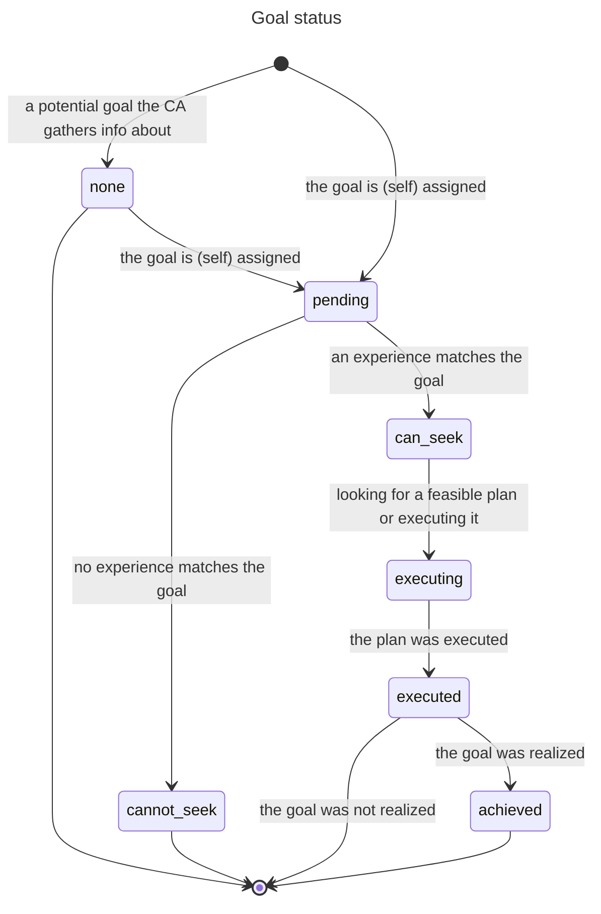
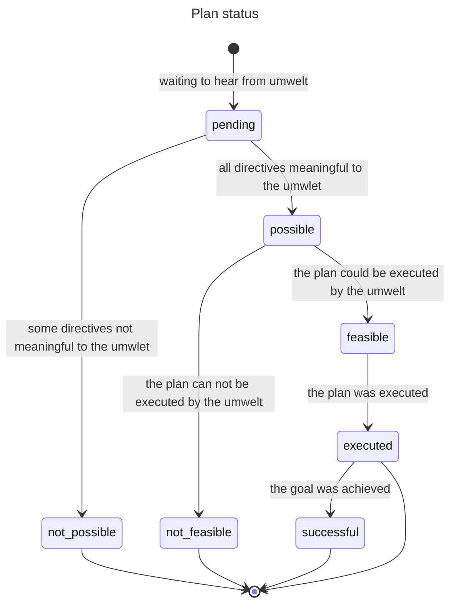

# Acting

A Cognition Actor (CA) acts by giving itself a goal (its intent) and by being given goals (directives), then finding plans that might achieve some or all of them, and by executing these plans.

A CA with an intent triggers the recursive, stepwise execution of a plan to achieve the intent, as soon as the plan is (transitively) ready to execute.

A CA initiates action by:

1- Giving itself an intent and assigning it a priority
2- Finding a workable plan for it to be carried out by its umwelt (with its sub-plans etc. down to effector actions)
3- Executing it (stepwise and recursively via sub-plans,  down to effector actions)

A workable plan is found only when a workable plan is found for each of its directives.

At any point in time, there may be multiple CAs attempting to achieve their own intents. These attempts may get in each other's way. Such conflicts are minimized, if not resolved, by executing plans according to precedence. Precedence is determined by the hierarchical level of the owner of the causal intent (higher-ups matter more) and by the priority a CA assigned to the achievement of its own intent.

## About Cognition Actors

The mind of a robot is a collective of CAs organizing themselves into an abstraction hierarchy as the robot learns how to survive.

Each Cognition Actor (CA) observes what lower-level CAs making up its umwelt are experiencing. The CA aggregates and integrates these observations into its own experiences and assigns a feeling to each one based on how its wellbeing fluctuates.

A CA acts to improve how it feels by intending to terminate bad experiences and persist good ones. Over its lifetime, a CA gives itself such goals (its intents) and, to achieve them, delegates sub-goals (directives) to its umwelt.

A CA finds plans to achieve goals and executes them. The CA eventually decides whether the execution of a plan achieved its intended goal, or whether a goal or plan has become stale and should be abandoned.

## Definitions

A **goal** is a relation/property, observed or experienced, that a CA aims to impact in a certain way.

An *intent* is a self-assigned goal of the CA to impact a felt experience.

A *directive* is a goal delegated by a CA to its umwelt CAs requesting that they impact experiences that the CA observed them having and that caused its own felt experiences.

A **plan** is a prioritized set of directives designed by a CA and sent to its umwelt CAs to achieve either its own intent or achieve a directive it received from a parent CA.

An *affordance* is a plan with an effectiveness score justifying its reuse.

Note that the only two "ground" concepts are `goal` and `plan`; `intent`, `directive` and `affordance` are perspectives on goals and plans.

## How Cognition Actors act

Acting happens at specific phases of the CA's lifecycle.

The CA repeats this lifecyle in a loop for as long as it survives. CAs higher up the hierarchy have longer lifecycles than lower-down CAs, which provides room for sub-plans to execute and to realize the higher-level goals that spawned them.

The lifecycle of a CA consists of these repeating **phases** constituting the equivalent of an OODA loop:

`predict` -> `observe` -> `experience` -> `feel` -> `act` -> `assess` -> (and back to `predict`)

The `act` phase is responsible for setting goals, making and prioritizing plans, and executing them. The `assess` phase is responsible, in part, for reviewing the success of extant goals and plans.

Achieving a goal and the planned sub-goals it depends on requires coordination between a parent CA and its umwelt CAs. During any phase of its lifecycle, a CA receives events and messages. An event is multicasted by a CA to its umwelt or parent CAs, whereas a message targets a single CA.

### Action phases

During the `act` phase, a CA:

* Updates what it curently considers to be its most urgent intent and assigns it a priority
  * but only if no intent is already progressing toward being executed
* Advances toward completion, as precedence dictates,
  * the status of its own intent
  * the statuses of directives received from parent CAs trying to achieve their own self-assigned or received goals
  
At the `assess` phase, a CA:

* Determines if its intent is stale
  * If so, the CA abandons it and lets its umwelt know
* Determines the success or failure of previously executed plans
  * If successful, it gives a score to executed plans built by the CA, perhaps making them affordances

### Communications

#### From parent to umwelt

##### Event `todo([directives=[Directive, ...]])`

A CA wants to know if its umwelt could potentially execute the sequence of directives of a plan it constructed. The event is received by all CAs in the umwelt of the broadcasting CA.

* For each directive,
  * if not relevant to the umwelt CA, respond to parent with `cannot_seek(Directive)`
  * if relevant, respond with `can_seek(Directive)`

##### Message `find_plan_for([directive=Directive, priority=Priority, intent_id=IntentId])`

A CA asks an umwelt CA to construct, with some priority, a plan to achieve a directive from its own plan, in the context of an intent (its own or that of an ancestor CA).

* If a plan is found
  * hold on to it
  * message back `plan_found_for(Directive, PlanId)`
* If a plan is **not** found
  * send back `no_plan_for(Directive)`

##### Message `execute(PlanId)`

A CA asks an umwelt CA to execute the plan the umwelt CA constructed to achieve a directive previously received from the CA.

* If the umwelt CA receiving this message is at level 1 (one level above effector CAs)
  * Execute the plan (a list of actions) at once
* Else
  * For each directive in the plan
    * Tell the CA that has a (sub) plan for this directive (an umwelt CA of the umwelt CA) to execute it
    * Wait for a confirmation message (`executed(Directive)`)
  * Send the parent CA confirmation message that the plan for the received directive was executed

See -Executing a Plan-.

##### Event `abandon([intent_id=IntentId])`

A CA tells its *transitive* umwelt to forget about all directives received and plans conceived in the context of an intent, its own or that of an ancestor CA.

##### Event `intent_completed([intent_id=IntentId])`

A CA tells its *transitive* umwelt a plan to achieve its intent was execuited.

#### From umwelt to parent(s)

##### Event `can_seek([directive=Directive])`

A CA tells its parent CAs, in response to a parent broadcasting a `todo` event to its umwelt, that a directive refers to one of its experiences (the CA might be able to impact it as requested).

##### Event `cannot_seek([directive=Directive])`

A CA tells its parent CAs, in response to a parent broadcasting a `todo` event to its umwelt, that a directive does **not** refer to one of its experiences

##### Event `plan_found_for([directive=Directive, plan_id=PlanId])`

A CA tells its parent CAs, in response to a `find_plan_for` message sent to it by a parent, that it successfully built a plan as requested, refering to by its unique id, to potentially achieve a directive.

See -Searching for a plan-.

##### Event `no_plan_for([directive=Directive])`

A CA tells its parent CAs, in response to a `find_plan_for` message sent to it by a parent, that it failed to build a plan to potentially achieve a directive.

See -Searching for a plan-

##### Event `executed([directive=Directive])`

A CA tells its parent CAs, in response to an `execute` event broadcasted by a parent, that it executed the plan it had constructed for that directive.

See -Executing a Plan-.

#### From CA to all umwelt effector CAs (level 1 to level 0)

A parent CA's plan (at level 1) are composite actions (e.g. [left_wheel:spin, left_wheel:spin, right_wheel:reverse_spin]). Each action is already known by the parent CA to be meaningful to at least one CA in its umwelt.

Being composite actions, such plans are executed at once instead of as a sequence of directives. Execution is assumed to always succeed.

##### Event `intended_actions([actions=[Action, ...], intent_id=IntentId])`

A level 1 CA tells its umwelt effector CAs of the actions it will want executed in the context of an intent (its own or that of an ancestor CA). An effector CA might have multiple parents concurrently wanting a list of actions executed. The effector CA sees the lists of actions, received in the context of a given intent, as overlapping, and not as cumulative.

* Effector CA accumulates the relevant actuations-to-be in the context of an intent
* If an effector CA is asked by a parent to anticipate N identical actions for an intent and then by another to anticipate N + M actions for the same intent
  * It accumulates N + M, not N + N + M in the context of the intent
* The effector CA sends `actions_received` back to the parent CA

##### Event `ready_actuations([intent_id=IntentId])`

A level 1 CA tells its umwelt effector CAs to prepare the body to realize the actions it associated with an intent.

* The effector CA takes all actions accumulated for the intent and sends them to the body for actuation (the parent CA will later tell the body to execute all readied actuations)
* The effector CA sends `actuations_ready` back to the parent CA

#### From effector CA to level 1 parent CA

An effector CA provides feedback to its parents during the execution of actions.

##### Message `actions_received(IntentId)`

An effector CA tells a parent CA that had broadcasted `intended_actions` to its umwelt that it has received them.

* When all effector CAs have confirmed receipt of actions for the intent from a parent
  * the parent can send `ready_actuations` to its umwelt

##### Message `actuations_ready(IntentId)`

An effector CA tells a parent CA that had broadcasted `ready_actuations` to its umwelt that it has prepared the body to actuate them.

* When all effector CAs have confirmed to the parent that actuations in the context of an intent are ready
  * the parent sends `execute` to the `body`

### Searching for a feasible plan to achieve a goal

When the CA has given itself an intent or received a directive to achieve, it:

* Constructs a plan that might achieve the goal
  * Submits it as `todo([Directive, ...])` to the umwelt for consideration
* Waits for affirmation or negation of relevance from all umwelt CAs (`can_seek(Directive)` and`cannot_seek(Directive)`)
* If at least one directive in the plan is irrelevant to all umwelt CAs
  * the plan is not possible
  * it sends back `no_plan_for(Directive)`
* If each directive in the plan is relevant to at least one umwelt CA
  * the plan is possible
* If a plan is possible
  * for each directive in the plan
    * the CA selects an umwelt CA that can seek it
    * asks it to `find_plan_for(Directive, Priority, IntentId)`
    * if the umwelt CA responds with `no_plan_for(Directive)` instead of `plan_found_for(Directive, PlanId)`
      * the CA asks another umwelt CA
  * The plan is feasible if, for all directives in it, there's an umwelt CA with a plan
  * The plan is not feasible, for any directive in the plan, there is no umwelt CA with a plan
* If the plan is feasible
  * the CA gives it a `PlanId` and holds on to it (associating it with an intent and a priority) and waits to be asked to execute it
  * the CA sends `plan_found_for(Directive, PlanId)` back to the parent who made the request
* If the plan is not feasible,
  * the CA searches for another plan
* If no feasible plan can be found
  * the CA sends back `no_plan_for(Directive)` back to the parent CA

### Abandoning an intent

A CA may receive at any time an event telling it that an ancestor abandoned an intent.

* Whenever receiving `abandon(IntentId)`
  * a CA lets go of any goal and plan associated with the intent

### Executing a plan

Let's assume that a CA has an intent as well as directives received to achieve intents of ancestor CAs.

The CA selects the pending (not executing or executed) goal (intent or received directive) with a feasible plan that has highest precedence. The plan being feasible implies that, for each directive in it, these is an umwelt CA with a feasible plan of its own to achieve that directive.

The execution of a plan is stepwise. The CA takes each pending directive in the plan in turn and asks the umwelt CA known to have a plan for it to execute its plan in the context of an intent. (`execute_plan(PlanId, IntentId)`). When the directive is confirmed as executed (`executed(Directive)`) by the umwelt CA, it moves to executing the next directive until the entire plan is executed. If the plan was for a received directive, the CA broadcasts `executed(Directive)` to its parents.

However, if a CA is at level 1 of the hierarchy (its umwelt are static CAs), its plan is a list of effector actions. They are not executed stepwise but all at once by telling effector CAs to accumulate them (wait for umwelt confirmation), then ready them for actuation (wait for umwelt confirmation), and then by telling the body to execute accumulated actions for the directives.

Note: An intent is recursively executed one directive at a time at any level of the hierarchy greater than 1. At level 1, a plan is a list of actions to be executed at once. Once the plan for an intent is executed, the CA with the intent broadcasts `intent_completed([intent_id=IntentId])`.

## Action-related state

Each CA independently manages its own changing state. The data composing this state captures, in the current and in remembered timeframes, what the CA has observed, experienced, felt etc. as well as its goals, plans and progress made in achieving these goals.
  
### Goal status

The status of a goal indicates where it is in its progression toward, hopefully, being achieved, including the possibility of reaching a dead end.

The possible statuses are:

* `none` - an undeclared  but potential goal - typically a goal from a sibling CA the CA gathers info about in case it later becomes a declared goal
* `pending` - no progress yet on declared goal
* `can_seek` - the goal was found to relate to one or more experiences of the CA
* `cannot_seek` - the goal does not relate to any experience
* `executing` - working on finding and executing a plan to achieve the goal
* `executed` - the plan for the goal was executed
* `achieved` - the goal was achieved

### Plan status

The status of a plan is implied by the statuses of its component directives.

* `pending` - waiting to hear from all umwelt CAs if each directive is meaningful or not
* `possible` - all directives are meaningful to some CA(s) in the umwelt
* `not_possible` - at least one directive is not meaningful to any CA in the umwelt
* `feasible` - the umwelt has a (transitively) feasible plan for all directives
* `not_feasible` - there is a directive for which no plan could be found by the umwelt
* `executed` - all directives in the plan were (recursively) executed
* `successful` - the goal of the plan was achieved

### Relevant state properties

The state of the CA consist of many properties, including the following the CA uses to manage making progress on its goals, self-assigned or received:

* `intent`- `goal{...}` - The CA's current intent
* `plans` - [`plan{...}`, ...] - All the plans built to achieve the intent and directives to execute
* `goal_states` - [`goal_state{...}`, ...] - The statuses of the CA's intent and of directives the CA received and sent, as well as messages it received that caused the status changes and messages it sent to report them

### Data structures

How goals, plans and goal states are encoded as data:

#### `goal{id: ID, of: CA_ID, target: Target, impact: Impact, priority: Priority, intent_level: Level}`

> **ID**: A goal's ID is fully determined by Target and Impact - *two goals in different plans will have the same ID if they are semantically the same*
>
> **CA_ID**: The id of the CA that assiged the goal (can be the CA itself if its intent, or a parent CA if a directive)
>
> **Target**: `target{origin: Origin, kind: Kind, value: Value}` - the state of a property or relation
>
> **Impact**: `create` | `persist` | `terminate`
>
> **Priority**: 0.0..1.0 - How important is achieving this goal
>
> **Level**: The level of the CA who's intent transitively led to this goal

#### `plan{id: ID, goal: GoalID, directives: [goal{...}, ...], , score: Score}`

> **ID**: A unique id for the plan. *No two plans have the same id, ever.*
>
> **GoalID**: The id of the goal this plan is for
>
> **Score**: 0.0..1.0 | none - Score is always none for plans received (it is up to the sender to score them)

#### `goal_state{goal: GoalID, status: Status, messages: [GoalMessage, ...]}`

> **GoalID**: The id of the goal - *Multiple plans might independently contain the same directive*
>
> **Status**: `none` | `pending` | `can_seek` | `cannot_seek` | `executing` | `executed` | `achieved`
>
> **GoalMessage** - A message received or sent about the goal, latest first. A received message can cause the status of a goal to change, a sent message communicates that change.
