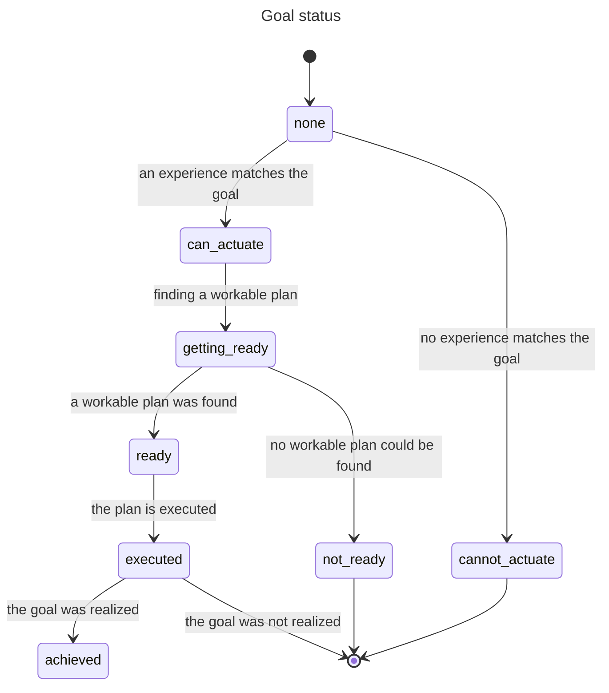
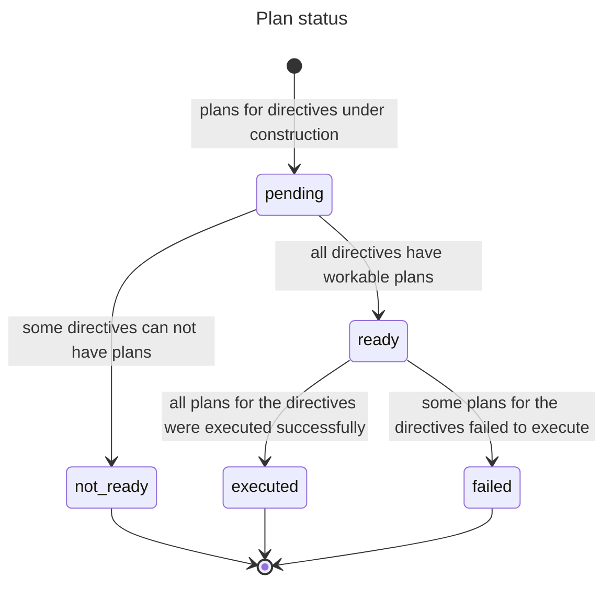

# Acting

A Cognition Actor (CA) acts by giving itself or being given goals, finding plans that might achieve them and then executing them.

## Definitions

A **goal** is a relation/property (observed or experienced) a CA aims to impact in a certain way.

An *intent* is a self-assigned goal (to impact one of its own felt experiences).

A *directive* is a delegated goal (a goal sent by a CA to its umwelt CAs requesting that they impact experiences that the CA observed).

A **plan** is a set of directives designed by a CA to achieve a goal (either its own intent or a directive it received) with some priority.

An *affordance* is a plan with an effectiveness score justifying its reuse.

Note that the only two "ground" concepts are `goal` and `plan`; `intent`, `directive` and `affordance` are perspectives on goals and plans.

## How Cognition Actors act

The mind of a robot is a collective of CAs organizing themselves into an abstraction hierarchy.

Each Cognition Actor (CA) observes (the experiences of) lower-level CAs making up its umwelt. The CA aggregates and integrates these observations into its own experiences and assigns a feeling to each experience based on how its wellbeing fluctuates.

Each CA aims at improving how it feels by terminating experiences that feel bad and persisting experiences that feel good. It does so by giving itself and its umwelt goals, by finding action plans to achieving its own goals (intents) and goals delegated to it (directives), and by executing them. The CA eventually decides whether a plan execution achieved its associated goal or whether a lingering goal or plan should be abandoned.

All this happens at specific phases of the CA's lifecycle. The CA repeats this lifecyle in a loop for as long as it persists. CAs higher up the hierarchy have longer lifecycles than lower-down CAs, which provides room for sub-plans to execute and realize higher-level plans that spawned them.

The lifecycle of a CA consists of these repeating phases constituting the equivalent of an OODA loop:

`predict` -> `observe` -> `experience` -> `feel` -> `act` -> `assess` -> (and back to `predict`)

The phases `act` and `assess` are involved in setting goals, making plans, executing plans, and reviewing the success of extant goals and plans.

The achieving of a goal and the planned sub-goals it depends on requires coordination between a parent CA and its umwelt CAs.

During any phase of its lifecycle, a CA receives messages

* from parent CAs:
  * `to_do` (add this plan to your to-do's - a plan is an all-or-none list of goals/directives to achieve)
  * `get_ready` (go ahead and try to find a plan for this directive in a to-do plan I sent you)
  * `execute` (execute the plan you said was ready to achieve a directive)
  * `abandon` (remove this plan I previously sent you to do)
* from umwelt CAs:
  * `can_actuate` (I could conceivably find on a plan for this directive)
  * `cannot_actuate` (I can't possibly find a plan for this directive)
  * `ready` (I have a plan I can execute to achieve this directive)
  * `not_ready` (I tried but did not find a plan for this directive)
  * `executed` (I successfully executed a plan to hopefully achieve this directive)
  * `execution_failed` (I failed to execute a plan to achieve this directive)

During the `act` phase, a CA works to:

* Update what is currently its most urgent intent
  * but only if no intent is already progressing toward being executed
* Advance, toward beging achieved and as priority dictates, the statuses
  * of its own intent
  * of directives in plans it received from parent CAs
  
At the `assess` phase, a CA works to:

* Determine if its intent is stale
  * If so, it abandons it and lets its umwelt know
* Determine the success or failure of previously executed plans
  * If success, give a score to executed plans built by the CA, perhaps making them affordances

## Action-related state

Each CA manages a changing state. The data composing this state captures, in the current and past timeframes, what the CA has observed, experienced, felt etc. as well as its goals, plans and how they are progressing.
  
### Goal status

The status of a goal indicates where it is in its progression toward being achieved, including being at a dead end.

The possible statuses are:

* `none` (no progress yet)
* `can_actuate` (the goal was found to relate to one or more experiences)
* `cannot_actuate` (the goal does not relate to any experience)
* `getting_ready` (working on a plan to achieve the goal)
* `ready` (the plan for the goal is ready)
* `executed` (the plan for the goal was executed)
* `achieved` (the goal was achieved)

### Plan status

The status of a plan is infered from the statuses of its component goals (aka directives).

The possible status of a plan are:

* `pending` (still determining the readiness of the plan's directives)
* `ready` (all directives in the plan are ready to have their own plans executed)
* `not_ready` (some directives in the plan can not be made ready)
* `executed` (all directives in the plan had their plans successfully executed)
* `failed` (not all directives in the plan had their plans successfully executed)

  
### Relevant state properties

The state of the CA consist of many properties, including the following it uses to manage its actions:

* `intent`- Goal - The CA's current intent
* `plans_in` - [Plan, ...] - All the plans received from parent CAs and being worked on
* `plans_out` - [Plan, ...] - The plans sent out to umwelt CAs to achieve the CA's intent and the directives from received plans
* `goal_states` - [GoalState, ...] - The statuses of the CA's intent and of directives the CA received and sent, as well as messages it received that caused the status changes and messages it sent to report them

### Data structures

The coded representations of goals, plans and goal states.

#### `goal{id: ID, target: Target, impact: Impact}`

> ID: A goal's ID is fully determined by Target and Impact - two goals in different plans will have the same ID if they are semantically the same
>
> Target: `target{origin: Origin, kind: Kind, value: Value}` - the state of a property or relation
>
> Impact: `create` | `persist` | `terminate`

#### `plan{id: ID, goal: GoalID, directives: [Goal, ...], , priority: Priority, score: Score, by: CA_ID}`

> ID: A unique id for the plan. No two plans have the same id.
>
> GoalID: The id of the goal this plan is for
>
> Goal: A `goal{...}` as directive
>
> Priority: 0.0..1.0 - How important is this plan to the CA that sent it out
>
> Score: 0.0..1.0 | none - Score is always none for plans received (it is up to the sender to score them)
>
> CA_ID: The id of the CA that built the plan (can be the CA if for its intent, or a parent CA)

#### `goal_state{goal: GoalID, status: Status, messages: [GoalMessage, ...]}`

> GoalID: The id of the goal - Note that multiple plans might unknowingly contain the same goal
>
> Status: `none` | `can_actuate` | `cannot_actuate` | `getting_ready` | `ready` | `executed` | `achieved`
>
> GoalMessage - A message received or sent about the goal, latest first. A received message causes the status of a goal to change or and a sent message communicates the change.
