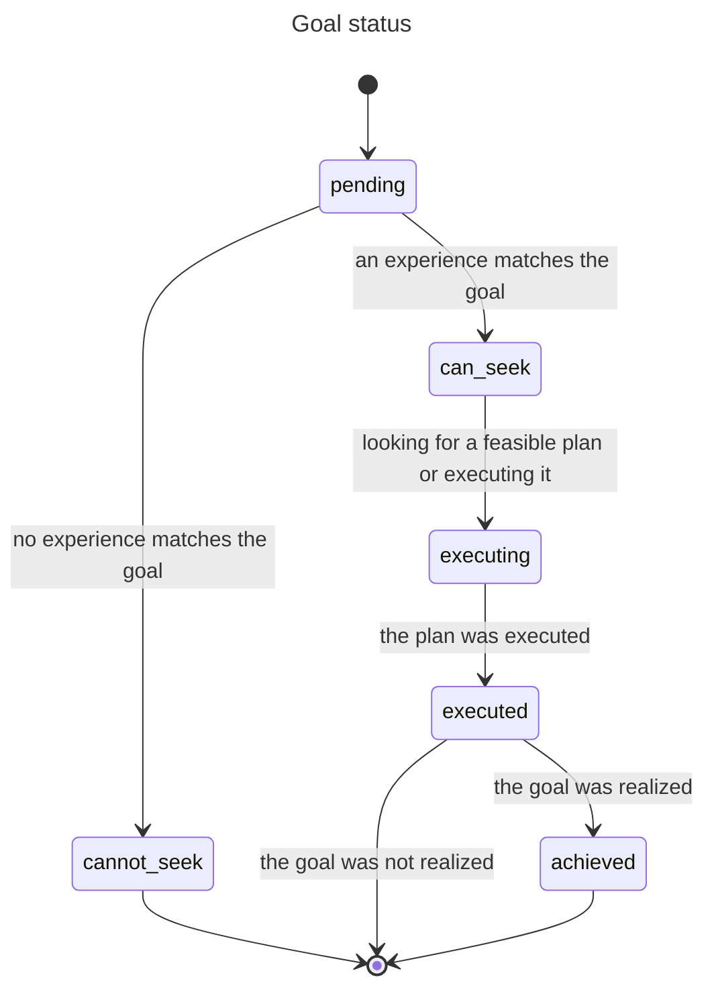
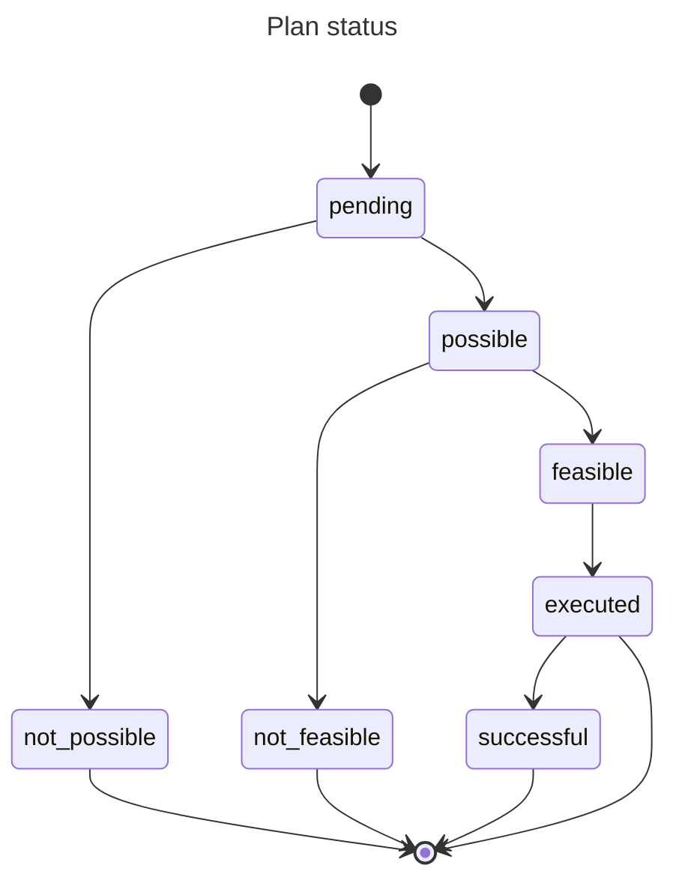

# Acting

A Cognition Actor (CA) acts by giving itself a goal (its intent) or being given goals (directives), by finding plans that might achieve some or all of these goals, and by executing these plans.

A CA with intent triggers the recursive execution of a plan to achieve the intent when the plan is (transitively) ready to execute.

A CA initiates action by:

1- Giving itself an intent and assigning it a priority
2- Finding a workable plan for it to be carried out its umwelt (with its sub-plans etc. down to effector actions)
3- Executing it (executing sub-plans etc. down to actieffectorsons)

A workable plan is found if there is a workable (sub) plan for each of its directives.

At any point in time, there may be multiple CAs attempting to achieve their own intents. These attempts may get in each other's way. Such conflicts are minimized by executing according to precedence. Precedence is determined by the hierarchical level of owner of the causal intent (higher-ups matter more) and by the priority a CA assigned to the achievement of its intent.

## About Cognition Actors

The mind of a robot is a collective of CAs organizing themselves into an abstraction hierarchy as the robot learns how to survive.

Each Cognition Actor (CA) observes what lower-level CAs making up its umwelt experience. The CA aggregates and integrates these observations into its own experiences and assigns a feeling to each one based on how wellbeing fluctuates.

A CA acts to improve how it feels by achieving goals of terminating bad experiences and persisting good ones. Over its lifetime, a CA gives itself goals (intents) and delegates sub-goals (directives) to its umwelt for achieving them. A CA finds plans to achieve goals and executes them. The CA eventually decides whether the execution of a plan achieved its goal, or whether a goal or plan has become stale and should be abandoned.

## Definitions

A **goal** is a relation/property, observed or experienced, that a CA aims to impact in a certain way.

An *intent* is a self-assigned goal to impact an own felt experience.

A *directive* is a goal delegated by a CA to its umwelt CAs requesting that they impact experiences that the CA observed them having.

A **plan** is a prioritized set of directives designed by a CA and sent to its umwelt CAs to achieve either its own intent or a directive it received from a parent CA.

An *affordance* is a plan with an effectiveness score justifying its reuse.

Note that the only two "ground" concepts are `goal` and `plan`; `intent`, `directive` and `affordance` are perspectives on goals and plans.

## How Cognition Actors act

Acting happens at specific phases of the CA's lifecycle.

The CA repeats this lifecyle in a loop for as long as it persists. CAs higher up the hierarchy have longer lifecycles than lower-down CAs, which provides room for sub-plans to execute and to realize higher-level goals that spawned them.

The lifecycle of a CA consists of these repeating phases constituting the equivalent of an OODA loop:

`predict` -> `observe` -> `experience` -> `feel` -> `act` -> `assess` -> (and back to `predict`)

The phases `act` and `assess` are involved in setting goals, making and prioritizing plans, executing plans, and reviewing the success of extant goals and plans.

Achieving a goal and the planned sub-goals it depends on requires coordination between a parent CA and its umwelt CAs. During any phase of its lifecycle, a CA receives events and messages. Events are multicasted by a CA to its umwelt CAs, whereas umwelt CAs send messages to their parent CAs.

### Action phases

During the `act` phase, a CA:

* Updates what it curently considers to be its most urgent intent and assigns it a priority
  * but only if no intent is already progressing toward being executed
* Advances toward completion, as priority dictates, the statuses
  * of its own intent
  * of directives received from parent CAs trying to achiev their own goals
  
At the `assess` phase, a CA:

* Determines if its intent is stale
  * If so, it abandons it and lets its umwelt know
* Determines the success or failure of previously executed plans
  * If successful, it gives a score to executed plans built by the CA, perhaps making them affordances

### Communication

#### From parent to umwelt

Event `todo([Directive, ...])`

* For each directive,
  * if not relevant to the umwelt CA, respond to parent with `cannot_seek(Directive)`
  * if relevant, respond with `can_seek(Directive)`

Message `plan_for(Directive, Priority, IntentId)`

* Find with some priority a plan to achieve a directive in the context of achieving an ancestor's intent
* If a plan is found
  * hold on to it
  * message back `plan_found_for(Directive, PlanId)`
* If plan **not** found
  * send back `no_plan_for(Directive)`

Event `execute(PlanId, IntentId)`

* Execute this plan found for a directive in the context of achieving an ancestor's intent

`abandon(IntentId)`

* Forget all directives to be executed and associated with an ancestors' intent

#### From umwelt to parent(s)

Event `can_seek(Directive)`

* Sent if the directive is relevant to the umwelt CA

Event `cannot_seek(Directive)`

* Sent if the directive is not relevant to the umwelt CA

Event `plan_found_for(Directive, PlanId)`

* Sent when the umwelt CA's found a plan for the directive

Event `no_plan_for(Directive)`

* Sent when the umwelt CA's can not find a plan for the directive

Event `executed(Directive)`

* Sent when a plan to achieve the directive was executed

#### From CA to all umwelt effector CAs (level 1 to level 0)

A parent CA's plan (at level 1) are composite actions (e.g. [left_wheel:spin, left_wheel:spin, right_wheel:reverse_spin]), each already known to be meaningful to at least one CA in its umwelt.

Being composite actions, such plans are executed at once instead of as a sequence of directives. Execution always succeeds.

Event `actions([Action, ...], IntentId)`

* Effector CA accumulates the relevant actions in the context of an intent
* If an effector CA is asked by a parent to ready N identical actions for an intent and then by another to ready N + M actions
  * It accumulates N + M, not N + N + M in the context of the intent
* The effector CA sends `actions_received(IntentId)` back to the parent CA

Event `ready_actuations(IntentId)`

* The effector CA takes all actions accumulated for the intent and sends them to the body for actuation (the parent CA will later tell the body to execute them)
* The effector CA sends `actuations_ready(IntentId)` back to the parent CA

#### From effector CA to parent CA

An intent is executed one directive at a time at each level of the hierarchy, thus also at level 1.

Message `actions_received(IntentId)`

* When all effector CAs have confirmed receipt of actions for the intent from a parent
  * the parent can send `ready_actuations` to its umwelt

Message `actuations_ready(IntentId)`

* When all effector CAs have confirmed acutations are ready for the intent to a parent
  * the parent can send `execute` to the `body`

### Searching for a feasible plan to achieve a goal

When the CA has an intent to achieve, or has received a directive to achieve:

* Construct a plan that might achieve the goal
  * Submit it as `todo([Directive, ...])` to the umwelt for consideration
* Wait for confirmation that all its directives can be sought, confirmed by `can_seek(Directive)`(meaningful)
  * or for a directive that can't be sought by the entire umwelt, confirmed by `cannot_seek(Directive)` (not meaningful)
* If at least one directive in the plan cannot be sought by all umwelt CAs
  * the plan is not possible
  * send back `no_plan_for(Directive)`
* If all directives in the plan can be sought by at least of umwelt CA
  * the plan is possible
* If a plan is possible
  * for each directive in the plan
    * select an umwelt that can seek it
    * ask it to `plan_for(Directive, Priority, IntentId)`
  * the plan is feasible if all umwelt CAs asked respond with `plan_found_for(Directive, PlanId)`
  * the plan is not feasible if any umwelt CA responds with `no_plan_for(Directive)`
* If the plan is feasible
  * give it a `PlanId` and hold on to it (associated with an intent and priority) and wait to be asked to execute it
  * send back `plan_found_for(Directive, PlanId)`
* If not feasible,
  * search for another plan
* If no feasible plan can be found
  * send back `no_plan_for(Directive)`

### Abandoning an intent

A CA may receive at any time an event telling it that an ancestor abandoned achieving an intent.

* Whenever receiving `abandon(IntentId)`
  * let go of any plan associated with the intent

### Executing a plan by the CA to achieve a goal (directive or intent)

Let's assume that a CA has an intent and directives it received to achieve the intent of an ancestor CA.

The CA selects the pending (not executing or executed) and goal (intent or received directive) with a feasible plan that has precedence. The plan for the goal being feasible implies that, for each directive in the plan, these is an umwelt CA with a feasible plan of its own to achieve that directive.

The execution of a plan is stepwise. The CA takes each pending directive in the plan in turn and asks the umwelt CA known to have a plan for it to execute its plan in the context of an intent. (`execute_plan(PlanId, IntentId)`). When the directive is confirmed as executed (`executed(Directive)`) by the umwelt CA, it moves to executing the next directive until the entire plan is executed. If the plan was for a received directive, the CA broadcasts `executed(Directive)` to its parents.

However, if a CA is at level 1 of the hierarchy (its umwelt are static CAs), its plan is a list of effector actions. They are not executed stepwise but all at once by telling effector CAs to accumulate them (wait for umwelt confirmation), then ready them for actuation (wait for umwelt confirmation), and then by telling the body to execute accumulated actions for the directives.

## Action-related state

Each CA independently manages its own changing state. The data composing this state captures, in the current and in remembered timeframes, what the CA has observed, experienced, felt etc. as well as its goals, plans and their progress.
  
### Goal status

The status of a goal indicates where it is in its progression toward, hopefully, being achieved, including the possibility of reaching a dead end.

The possible statuses are:

* `pending` - no progress yet
* `can_seek` - the goal was found to relate to one or more experiences of the CA
* `cannot_seek` - the goal does not relate to any experience
* `executing` - working on finding and executing a plan to achieve the goal
* `executed` - the plan for the goal was executed
* `achieved` - the goal was achieved

### Plan status

The status of a plan is implied by the statuses of its component directives.

* `pending` - waiting to hear from all umwelt CAs if all directives are meaningful to at least one umwelt CA
* `possible` - all directives are meaningful to the umwelt
* `not_possible` - at least one directive is not meaningful to the umwelt
* `feasible` - the umwelt has a (transitively) feasible plan for all directives
* `not_feasible` - there is a directive for which no plan could be found by the umwelt
* `executed` - all directives had their umwelt plans executed
* `successful` - the goal planned for was achieved

### Relevant state properties

The state of the CA consist of many properties, including the following it uses to manage its actions:

* `intent`- `goal{...}` - The CA's current intent
* `plans` - [`plan{...}`, ...] - All the plans built to achieve the intent and directives to execute
* `goal_states` - [`goal_state{...}`, ...] - The statuses of the CA's intent and of directives the CA received and sent, as well as messages it received that caused the status changes and messages it sent to report them

### Data structures

How goals, plans and goal states are encoded as data:

#### `goal{id: ID, target: Target, impact: Impact}`

> ID: A goal's ID is fully determined by Target and Impact - two goals in different plans will have the same ID if they are semantically the same
>
> Target: `target{origin: Origin, kind: Kind, value: Value}` - the state of a property or relation
>
> Impact: `create` | `persist` | `terminate`

#### `plan{id: ID, goal: GoalID, directives: [goal{...}, ...], , priority: Priority, score: Score, by: CA_ID}`

> ID: A unique id for the plan. No two plans have the same id.
>
> GoalID: The id of the goal this plan is for
>
> Priority: 0.0..1.0 - How important is this plan to the CA that sent it out
>
> Score: 0.0..1.0 | none - Score is always none for plans received (it is up to the sender to score them)
>
> CA_ID: The id of the CA that built the plan (can be the CA if for its intent, or a parent CA)

#### `goal_state{goal: GoalID, status: Status, messages: [GoalMessage, ...]}`

> GoalID: The id of the goal - Note that multiple plans might unknowingly contain the same goal
>
> Status: `pending` | `can_seek` | `cannot_seek` | `executing` | `executed` | `achieved`
>
> GoalMessage - A message received or sent about the goal, latest first. A received message can cause the status of a goal to change, a sent message communicates that change.
