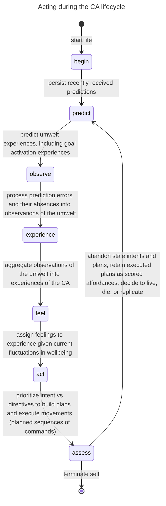
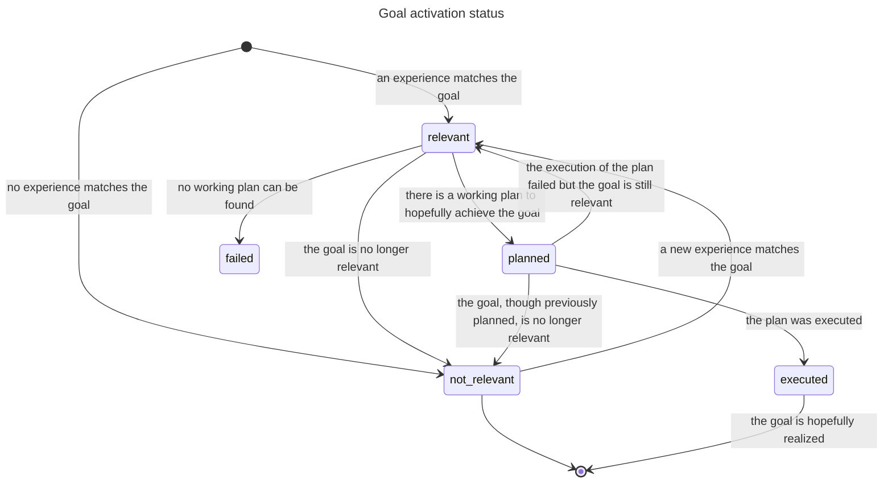

# Acting

## How Cognition Actors act

The mind of a robot is a collective of Cognition Actors (CAs) organizing themselves into an abstraction hierarchy as the robot learns how to survive.

Each Cognition Actor (CA) observes what lower-level CAs making up its umwelt are experiencing. The CA aggregates and integrates these observations into its own experiences and assigns a feeling to each one based on how its wellbeing is fluctuating.

> There are three kinds of CAs: sensor CAs -each with a body's sensor as its umwelt-, effector CAs -each with a body's effector as its umwelt, and dynamic CAs -CAs that have other CAs in their umwelt-.
Henceforth, CAs refers to dynamic CAs unless otherwise indicated.

A CA acts to improve how it feels by intending to terminate bad experiences and persist good ones. Over its lifetime, a CA gives itself goals to that effect (its intents) and, to achieve them, makes and executes plans, each plan a sequence of (sub)goals to be achieved by its umwelt. The CA delegates these sub-goals (directives) to its umwelt, or, if it is a low-level CA, one with effector CAs in its umwelt, it issues direct commands (spin your wheel, etc.).

A CA thus acts by executing plans it builds to achieve a goal it gives itself (its intent), and to achieve goals assigned to it (directives) as planned by parent CAs.

A CA with an intent triggers the recursive, stepwise execution of a plan to achieve the intent, as soon as the plan is (transitively) ready to execute.
The recursion terminates with planned commands. A plan by a low-level CA, one with effector CAs in its umwelt, consists of commands, instead of goals, and only commands.
A command directs the activation of a body's effector (e.g. spin the left wheel once etc.) Such a plan, with its commands, embodies a "movement" and all commands in a movement are executed at once.

A CA initiates actions by:

1. Giving itself an intent and assigning it a priority
2. Finding a workable plan for it to be carried out by its umwelt (with its sub-plans etc. down to effector commands)
3. Executing it (stepwise and recursively via sub-plans,  down to command-defined "movements")

A working plan is found by a CA only when, for each of the plan's directives (goals or commands to be achieved/executed), working plans are found by the CA's umwelt to achieve each of the goals/directives, or the umwelt contains effector CAs capable of carrying out the commands.

At any point in time, there may be multiple CAs attempting to achieve their own intents. These attempts may get in each other's way. Such conflicts are minimized, if not resolved, by executing plans according to precedence. Precedence is determined by the hierarchical level of the owner of the causal intent (higher-ups matter more) and by the priority assigned to the achievement of the intent.
This prioritization is realized by predicting the realization of important goals before that of less important ones.

The CA eventually assesses whether the execution of a plan achieved its intended goal, or whether a goal or plan has become stale and should be abandoned. Effective plans are retained as affordances for later reuse, pre-empting building plans de novo.

## Definitions

An *intent* is a self-assigned goal of the CA to impact one of its felt experiences.

A *goal*'s target is a relation/property experienced by a CA, to be impacted, with some priority, on behalf of an intent at some level of abstraction.

A *command* is an action (spin the wheel, reverse-spin the wheel, etc.) requested by a CA of an effector CA in its umwelt.

A *plan* is a prioritized sequence of goals or commands assembled by a CA to achieve either its own intent or a goal from a parent CA's plan (a directive).

An *activation* is a property of a goal whose value is its status toward achieving the goal.

An *affordance* is a pre-built plan for achieving a stated goal, with an effectiveness score informing its reuse.

## Acting and the CA lifecycle

Acting happens throughout all phases of a CA's lifecycle.

The CA repeats its lifecyle in a loop for as long as it survives.
CAs higher up the hierarchy have longer lifecycles than lower-down CAs
This gives the CA time to integrate information from its umwelt tasked with executing the CA's plans.

The lifecycle of a CA consists of these repeating **phases** defining the equivalent of an OODA loop:

`begin` -> `predict` -> `observe` -> `experience` -> `feel` -> `act` -> `assess` -> (and back to `predict`)

```mermaid
---
title: Acting during the CA lifecycle
---
stateDiagram-v2
  [*] --> begin : start life
  begin --> predict : persist recently received predictions
  predict --> observe : predict umwelt experiences, including goal activation experiences
  observe --> experience : process prediction errors and their absences into observations of the umwelt
  experience --> feel : aggregate observations of the umwelt into experiences of the CA
  feel --> act : assign feelings to experience given current fluctuations in wellbeing
  act --> assess : prioritize intent vs directives to build plans and execute movements (planned sequences of commands)
  assess --> predict : abandon stale intents and plans, retain executed plans as scored affordances, decide to live, die, or replicate
  assess --> [*] : terminate self
```

All phases of the lifecycle are involved in acting:

* The `begin` phase persists recently received predictions, including predictions about goal activations
* The `predict` phase is responsible for predicting the activation of directives planned by the CA (i.e. making activation predictions)
* The `observe` phase processes received activation prediction errors, and those not received, into activation observations
* The `experience` phase updates activation experiences from activation observations (e.g. a directive in a plan is uniformly not_relevant across the umwelt failing the plan etc,)
* The `feel` phase assigns a feeling to activation experiences, just as it does for all experiences
* The `act` phase is responsible for setting intent, making and prioritizing plans for intent and directives, and executing them (executed plans are directly experienced as activations).
* The `assess` phase is responsible, in part, for reviewing the success of extant goals and plans, and possibly dropping some because of staleness.

Achieving a goal and the planned sub-goals it depends on requires coordination between a parent CA and its umwelt CAs, all of which are separate processes.

During any phase of its lifecycle, a CA can receive:

* activation predictions (predictions about the status of a parent plan directives) from its parents
  * to which it immediately responds with prediction errors if appropriate
* activation prediction errors from its umwelt, from predictions it made earlier,
  * about a directive being `not_relevant`, `relevant`, `planned`, `executed` or `failed`

Progressing toward the realization of a planned goal is entirely driven by

* predicting (sub) goals (their activation statuses) as `relevant`, `planned` or `executed`,
* reacting to these predictions by possibly building or executing plans,
* responding with prediction errors that give the actual status, including `not_relevant`, and `failed`,
* and reacting to these goal activation prediction errors to update observations and experiences about the progress toward goals.

Once a CA stops making predictions about the status of a goal, it implicitly signals to its umwelt that it is no longer interested in having it pursue the goal.
Predictions received persist, unless overridden, across a few lifecycles of a CA to match the longer lifecycles of its parents.
It is possible for a prediction received in lifecycle T to cause a prediction error to be sent back only in lifecycle T+1.

### Phases and acting

The CA manages the states of its active goals as activation experiences across all phases of its lifecycle.

During all phases, upon receiving an activation prediction, the CA:

* sends back nothing if the status of the directive is as predicted
* otherwise
  * if the directive in the goal activation prediction does not correspond, or no longer corresponds, to any of its experiences
    * it sends back a `not_relevant` activation prediction error, and
    * forgets any goal activation experience and plan about the directive
  * else
    * if the directive is new, it creates an activation experience with status `relevant` to track its progress

At the `begin` phase, a CA:

* Persists predictions, including goal activation predictions, received during the approximate timeframe of parent CAs
  * To signal that the parent CAs' interest in goal activations is maintained for the duration of their own current timeframe

During the `predict` phase, a CA:

* Emits activation predictions to its umwelt for all directives in an active plan
  * A plan is active if the directives in it are neither all `executed` nor all `failed`
  * An activation prediction about the directive is sent to each CA in the umwelt with value:
    * `executed` to cause the execution of plans the umwelt built for the directive
      * only if
        * all directives in it are observed as `planned` and
        * the planned goal is an intent
        * the planned goal is a received directive predicted as `executed`
    * `planned` to cause the activation of the directive to be planned by the umwelt
      * only if all directives in the plan are observed as `relevant`
    * `relevant` to otherwise validate that the directive is (still) meaningful to the CA's umwelt

During the `observe` phase, a CA:

* Aggregates into activation observations (one per directive) the activation prediction errors received from the umwelt
  * Prediction errors about the activation of a given directive are aggregated into a single observation with value:
    * `failed` if the entire umwelt sent back prediction errors correcting to `failed`
    * else `not_relevant` if the entire umwelt sent back prediction errors correcting to `not_relevant`
    * else `executed` if any prediction error corrects to `executed`
    * else `planned` if any prediction error corrects to `planned`
    * else `relevant` if any prediction error corrects to `relevant`
* Aggregates uncontradicated activation predictions into activation observations
  * One per goal activation, with value determined as above

During the `experience` phase, a CA:

* Updates activation experiences about is own goals (its own intent and the directives it received), from its observations of umwelt directive activations
  * An activation experience for a CA's goal updates to status
    * `failed`
      * if, for all directives in the CA's plan for the CA's goal, their activations are observed as `not_relevant` or `failed`
    * else `executed`
      * if, for all directives in the CA's plan for the CA's goal, their activations are observed as `executed`
    * else `planned`
      * if, for all directives in the CA's plan for the CA's goal, their activations are observed as `planned` or `executed`
    * else it keeps the current status

During the `act` phase, a CA:

* Gives itself an intent (to impact the most felt experience), assigns it a priority, and experiences it as `relevant`
  * but only if it has none already
  * then it makes a plan by either
    * reusing an affordance for its intent and experiencing its intent activation as `planned`
    * or building a plan by sequencing directives
      * if the plan is a movement (all commands), the intent activation is experienced as `planned`
* For each (relevant) directive for which it received a `planned` activation prediction, the CA
  * reuses an affordance and experiences the directive's activation as `planned`
  * or builds a plan if none exists
* If a plan is a movement (i.e. its directives are commands), and
  * if the planned goal's activation is predicted as `executed`, or
  * or the planned goal is an intent (necessarily experienced as `planned`),
  * the movement is executed by
    * requesting all commanded effector CAs to prepare actuations
    * telling the body to execute prepared actuations at once
  * the goal activation is experienced as `executed`

See [design note](../building_plans.md) on building plans.
  
At the `assess` phase, a CA:

* Determines if its intent is stale or no longer the most urgent
  * If so
    * the CA abandons the intent
    * drops any plan it was building for it
    * and forgets the intent's activation experience
* Determines if a received directive is stale
  * It is stale if no prediction about its activation was recently received (i.e no parent apparently cares anymore)
  * If stale
    * the CA drops any plan for it
    * and forgets the directive's activation experience
* Determines if a plan is stuck
  * It is stuck if
    * the plan's goal is experienced as `failed`
    * or the plan is stale (it was created too many timeframes ago and never executed)
  * If stuck,
    * the plan is dropped
    * and the plan's goal activation is now experienced as only `relevant`
* Determines the effectiveness of affordances
  * Add all executed plans to the CA's affordances (no duplication)
    * A plan is executed if its goal activation is experienced as `executed`
  * Update the score of all affordances as a combination of goal achievement correlation and freshness
    * If the plan's goal is achieved, correlation is inversely proprtional to delta time between goal achievement and plan execution
      * The maximum correlation value is retained
    * Freshness decreases with time elapsed since last executed
  * Drop executed plans

## Action-related states

Each CA independently manages its own changing state.

For a dynamic CA (any CA other than a sensor or effector CA), the data composing this state captures, in the current and in remembered timeframes,
what the CA has observed, experienced, felt etc. as well it intent, the plans it built, and the affordances it discovered.

An effector CA need only manage the actuation readiness of received commands in communication with the body.
  
### Goal activation status

The status of a goal activation (observed or experienced) indicates where it is in its progression toward, hopefully, being achieved, including the possibility of having reached a dead end.

The possible statuses are:

* `relevant` - the goal was found to relate to one or more experiences of the CA
* `not_relevant` - the goal does not relate to any current experience
* `planned` - a plan exists to (hopefully) achieve the goal
* `executed` - the plan for the goal was executed
* `failed` - no working plan can be found or executed for the goal

```mermaid
---
title: Goal activation status
---
stateDiagram-v2
    [*] --> relevant : an experience matches the goal
    [*] --> not_relevant :  no experience matches the goal
    not_relevant --> [*]
    relevant --> planned : there is a working plan to hopefully achieve the goal
    relevant --> failed : no working plan can be found
    relevant --> not_relevant : the goal is no longer relevant
    not_relevant --> relevant : a new experience matches the goal
    planned --> executed : the plan was executed
    planned --> relevant : the execution of the plan failed but the goal is still relevant
    planned --> not_relevant : the goal, though previously planned, is no longer relevant
    executed --> [*] : the goal is hopefully realized
```  

### Relevant state properties

The state of a dynamic CA consist of many properties, including the following the CA uses to manage acting, i.e. making progress on its goals, self-assigned or received:

* `intent`- `goal{...}` - The CA's current intent
* `plans` - [`plan{...}`, ...] - All the plans the CA built to achieve its intent and received directives
* `affordances` - [affordance{...}, ...] - All goal-achieving plans scored high-enough to be worth remembering

### Data structures

How goals, commands, plans, and affordances are represented:

#### `goal{target: Target, impact: Impact, priority: Priority, intent_level: Level}`

> **Target**: `target{origin: Origin, kind: Kind, value: Value}` - the state of an observed/experienced property/relation to be impacted
>
> **Impact**: `create` | `persist` | `terminate`
>
> **Priority**: 0.0..1.0 - How important is achieving the originating intent
>
> **Level**: The level of the CA who's intent transitively led to this goal (goal precedence is a function of priority and intent level)

#### `plan{goal: Goal, directives: [Directive, ...]}`

> **GoalID**: The id of the goal this plan is for
>
> **Directive**: goal{} or command{}

#### `command{effector_ca: Effector_ID, action: Action}`

> **Effector_ID**: the ID of the effector commanded to take the action
> **Action**: the name of the action, e.g. `spin` or `reverse_spin`, etc.

#### `affordance{plan: Plan, score: Score}`

> **Plan**: plan{...}
>
> **Score**: 0.0..1.0 | none
