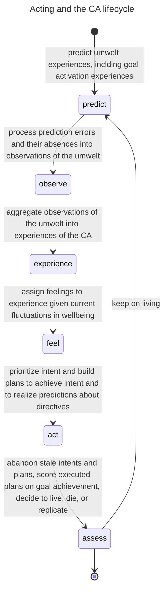
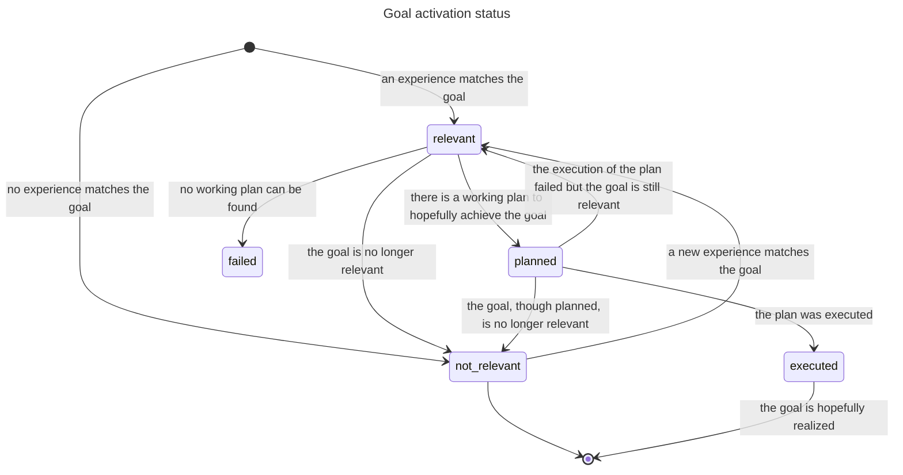
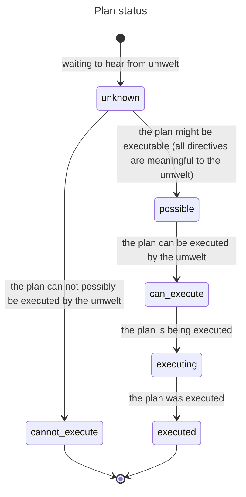

# Acting

## How Cognition Actors act

The mind of a robot is a collective of Cognition Actors (CAs) organizing themselves into an abstraction hierarchy as the robot learns how to survive.

Each Cognition Actor (CA) observes what lower-level CAs making up its umwelt are experiencing. The CA aggregates and integrates these observations into its own experiences and assigns a feeling to each one based on how its wellbeing is fluctuating.

> There are three kinds of CAs: sensor CAs -each with a body's sensor as its umwelt-, effector CAs -each with a body's effector as its umwelt, and synamic CAs -CAs that have other CAs in their umwelt-.
Henceforth, CAs refers to dynamic CAs unless otherwise indicated.

A CA acts to improve how it feels by intending to terminate bad experiences and persist good ones. Over its lifetime, a CA gives itself goals to that effect (its intents) and, to achieve them, takes action. It delegates sub-goals (directives) to its umwelt, or, if a low-level CA, one with effector CAs in its umwelt, it issues direct commands (spin your wheel, etc.).

A CA finds plans to achieve goals and it executes them. The CA eventually decides whether the execution of a plan achieved its intended goal, or whether a goal or plan has become stale and should be abandoned.

A Cognition Actor (CA) thus acts by giving itself a goal (its intent) and by being assigned goals (directives), and then finding plans that might achieve some or all of them, and by executing these plans.

A CA with an intent triggers the recursive, stepwise execution of a plan to achieve the intent, as soon as the plan is (transitively) ready to execute.
The recursion terminates with planned commands. A plan by a low-level CA, one with effector CAs in its umwelt, consists of commands, instead of goals, and only commands.
A command directs the activation of a body's effector (e.g. spin the left wheel once etc.) Such a plan, with its commands, embodies a "movement" whereby all commands are executed at once.

A CA initiates actions by:

1. Giving itself an intent and assigning it a priority
2. Finding a workable plan for it to be carried out by its umwelt (with its sub-plans etc. down to effector commands)
3. Executing it (stepwise and recursively via sub-plans,  down to command-defined "movements")

A working plan is found by a CA only when, for each of the plan's directives (goals or commands to be achieved/executed), working plans are found by the CA's umwelt to achieve each of the goals, or the umwelt contains effector CAs capable of carrying out the commands.

At any point in time, there may be multiple CAs attempting to achieve their own intents. These attempts may get in each other's way. Such conflicts are minimized, if not resolved, by executing plans according to precedence. Precedence is determined by the hierarchical level of the owner of the causal intent (higher-ups matter more) and by the priority assigned to the achievement of the intent.
This prioritization is realized by predicting the execution of important goals before that of less important ones.

## Definitions

A *goal* is a relation/property experienced by the CA or its umwelt to be initiated, persisted or terminated.

An *intent* is a self-assigned goal of the CA to impact a felt experience it has.

A *directive* is a goal delegated by a CA to its umwelt CAs for them to achieve however they see fit.

A *command* is an action (spin the wheel, reverse-spin the wheel, etc.) requested by a CA of an effector CA in its umwelt.

A *plan* is a prioritized set of directives or commands assembled by a CA to achieve either its own intent or a directive from a parent CA.

An *affordance* is a pre-built plan with an effectiveness score informing its reuse.

Note that the only "ground" concepts here are `command`, `goal` and `plan`; `intent`, `directive` and `affordance` are "perspectives" on them.

## Acting and the CA lifecycle

Acting happens throughout a CA's lifecycle.

The CA repeats its lifecyle in a loop for as long as it survives. CAs higher up the hierarchy have longer lifecycles than lower-down CAs, which provides room for sub-plans to execute and realize the higher-level goals that spawned them.

The lifecycle of a CA consists of these repeating **phases** defining the equivalent of an OODA loop:

`predict` -> `observe` -> `experience` -> `feel` -> `act` -> `assess` -> (and back to `predict`)

```mermaid
---
title: Acting and the CA lifecycle
---
stateDiagram-v2
  [*] --> predict : predict umwelt experiences, inclding goal activation experiences
  predict --> observe : process prediction errors and their absences into observations of the umwelt
  observe --> experience : aggregate observations of the umwelt into experiences of the CA
  experience --> feel : assign feelings to experience given current fluctuations in wellbeing
  feel --> act : prioritize intent and build plans to achieve intent and to realize predictions about directives
  act --> assess : abandon stale intents and plans, score executed plans on goal achievement, decide to live, die, or replicate
  assess --> predict : keep on living
  assess --> [*]
```

All phases of the lifecycle are involved in acting:

* The `predict` phase is responsible for predicting the activation of directives planned by the CA (i.e. making activation predictions)
* The `observe` phase processes received activation prediction errors, and those not received, into activation observations
* The `experience` phase updates activation experiences and plan status from activation observations (e.g. a directive in a plan is uniformly not_relevant across the umwelt failing the plan etc,)
* The `feel` phase assigns a feeling to activation experiences, just as it does for all experiences
* The `act` phase is responsible for setting intent, making and prioritizing plans for intent and directives, and executing them (executed plans are directly experienced as activations).
* The `assess` phase is responsible, in part, for reviewing the success of extant goals and plans, and possibly dropping some because of staleness.

Achieving a goal and the planned sub-goals it depends on requires coordination between a parent CA and its umwelt CAs, all of which are separate processes.

During any phase of its lifecycle, a CA can receive:

* activation predictions (predictions about the status of a parent plan directives) from its parents
  * to which it immediately responds with prediction errors if appropriate
* activation prediction errors from its umwelt, from predictions it made earlier,
  * about a directive being `not_relevant`, `relevant`, `planned`, `executed` or `failed`

### Phases and acting

The CA manages the states of its active goals as activation experiences across all phases of its lifecycle.

During all phases, upon receiving an activation prediction, the CA:

* sends back nothing if the status of the directive is as predicted
* otherwise
  * if the directive does not correspond to any of its experiences
    * it sends back a `not_relevant` activation prediction error
  * else
    * it creates an activation experience, if the directive is new, to track its progress
    * and it sends back
    * a `relevant` prediction error if the CA has an experience it could potentially impact as directed
    * a `planned` prediction error if the CA has built a working plan
    * a `failed` prediction error if the CA tried but recently failed to build a working plan
    * an `executed` prediction error if the CA recently executed a plan to achieve the directive

During the `predict` phase, a CA:

* Emits activation predictions for all active umwelt directives in its working plans
  * a working plan is one where all directives are either already `executed` (an activation is observed as executed), `relevant` or `planned`
  * an umwelt directive is active if no `executed` activation is observed in the umwelt

During the `observe` phase, a CA:

* Converts activation prediction errors in activation observations
* Converts uncontradicated activation predictions into the other activation observations

During the `experience` phase, a CA:

* Updates activation experiences from activation observations
  * An activation experience updates to status
    * `planned`
      * if, for all directives in the CA's plan for the activated goal, there is at least one umwelt CA observed as having a `planned` activation experience for the directive
    * `failed`
      * if, for all directives in the CA's plan for the activated goal, all umwelt CAs are observed as having a `failed` or `not_relevant` activation experience for the directive
    * `executed`
      * if, for all directives in the CA's plan for the activated goal, at least one umwelt CA is observed as having an `executed` activation experience for the directive

During the `act` phase, a CA:

* Gives itself an intent (to impact the most felt experience) and assigns it a priority
  * but only if it has none already
* Builds or reuses a plan for its intent and for each directive predicted by a parent as planned
  * One plan per goal
  * Plans are built as urgency dictates
  * A plan with all directives observed as `planned` or `executed` is a working plan, and the goal of the plan is experienced as `planned`
* Executes the plan for its intent if its activation is experienced as `planned`
* Executes the plan for a directive currently predicted as `executed` if the directive's activation is (experienced as) `planned`
  
At the `assess` phase, a CA:

* Determines if its intent is stale or no longer the most urgent
  * If so, the CA abandons it and any plan for it
* Determines if a plan for a directive is stale
  * It is stale if no prediction about its goal being `planned` or `executed` was recently received (i.e no parent apparently cares anymore)
* Determines the success or failure of previously executed plans
  * Each built and executed by the CA is given a score (or its score is updated) from an assessment of its success, making it a more or less attractive affordance

### Scenarios

There are two plan execution scenarios, one for the CA's intent and another for a received directive.
Plan executions always originate from intents.

#### Achieving an intent

* A CA assigns itself a goal (its intent).
* The CA immediately experiences an activation of the intent as `relevant`
* The CA works on building a plan for the intent (this may be in competition with planning for more urgent, received directives)
* Once the intent activation is experienced as `planned` (a working plan exists for the goal)
  * until all directives in the plan are observed as `executed` at least once, or uniformly as `failed`
    * an `executed` activation experience is predicted for each directive in the plan
  * once done, the intent activation is experienced as either `executed` (all directives executed) or `failed`

#### Building a plan to achieve a goal

* The CA determines a sequence of goals (directives to its umwelt) that, if realized, could achieve the goal.
* For each directive in the plan, the CA predicts (to its umwelt CAs) that each is a `relevant` activation experience
* From this moment on, unless the intent is assessed to be stale,
  * If any of the directive activation is observed (from prediction errors receievd and not) to be uniformly `not_relevant` or `failed`,
    * the plan is failed and a new plan is attempted
    * if all possible plans are exhausted,
      * the CA experiences the activation of the intent as `failed`
      * the CA sends an event announcing the intent to be abandoned
  * Else if all directive activations are not yet observed to be `planned`, the CA predicts all to be `planned`
* Once all directive activations in the plan are observed in the umwelt to be `planned`
  * a working plan was built and the CA experiences the activation of the intent as `planned`

#### Achieving a directive

A CA receives and reacts to predictions about the activation of directives planned by a parent CA.
Predictions match or not irrespective of the intents associated with the directives.

If a directive activation is predicted as:

* `relevant`
  * If the directive does not correspond to a current experience,
    * send a prediction error with actual value `not_relevant`
  * Else experience the activation of the goal (which exists in the context of an intent) as `relevant`
* `planned`
  * If the CA has a working plan, do nothing
  * Else if the directive does not correspond to a current experience
    * send a prediction error with actual value `not_relevant`
  * Else if the activation of the directive is experienced as `relevant`,
    * start working on a plan or keep working on it (see above)
    * send a prediction error with actual value `relevant`
  * Else if the CA failed to build a working plan for the directive
    * send a prediction error with actual value `failed`
  * Else if the CA recently executed a plan to achieve the directive
    * send a prediction error with actual value `executed`
* `executed`
  * If the directive activation is already experienced as `executed` do nothing
  * Else if all sub-directives are observed as `executed`
    * then the directive is experienced as `executed`
    * else if there is a working plan, send a prediction error with actual value `planned`
  * Else if the directive no longer corresponds to a current experience
    * send a prediction error with actual value `not_relevant`
  * Else if the directive activation is experienced as `failed` (any planned sub-directive activation is observed to be failed)
    * send a prediction error with actual value `failed`
  * Else if the directive activation is experience as `planned`
    * if the plan contains goals as directives
      * predict to each umwelt CA an `executed` activation experience for each directive in the directive's plan
    * if the directive's plan contains commands as sub-directives, i.e. it prescribes a "movement"
      * execute the movement at once
        * accumulate actuations per effector
        * ready the body
        * tell the body to execute all accumulated actuations
    * the CA experiences the directive activation as `executed`

## Action-related states

Each CA independently manages its own changing state.

For a dynamic CA (any CA other than a sensor or effector CA), the data composing this state captures, in the current and in remembered timeframes,
what the CA has observed, experienced, felt etc. as well it intent and the plans it built.

An effector CA need only manage the actuation readiness of received commands in communication with the body.
  
### Goal activation status

The status of a goal activation (observed or experienced) indicates where it is in its progression toward, hopefully, being achieved, including the possibility of reaching a dead end.

The possible statuses are:

* `relevant` - the goal was found to relate to one or more experiences of the CA
* `not_relevant` - the goal does not relate to any current experience
* `planned` - a working plan exists to (hopefully) achieve the goal
* `executed` - the plan for the goal was executed "all the way down" to effector actuations
* `failed` - no working plan can be found or executed for the goal

```mermaid
---
title: Goal activation status
---
stateDiagram-v2
    [*] --> relevant : an experience matches the goal
    [*] --> not_relevant :  no experience matches the goal
    not_relevant --> [*]
    relevant --> planned : there is a working plan to hopefully achieve the goal
    relevant --> failed : no working plan can be found
    relevant --> not_relevant : the goal is no longer relevant
    not_relevant --> relevant : a new experience matches the goal
    planned --> executed : the plan was executed
    planned --> relevant : the execution of the plan failed but the goal is still relevant
    planned --> not_relevant : the goal, though planned, is no longer relevant
    executed --> [*] : the goal is hopefully realized
```  

### Plan status

The status of a plan is implied by the observed activation statuses of its component directives.

* `unknown` - waiting to hear from all umwelt CAs if (the activation of) each directive is relevant or not
* `possible` - all directives in the plan are relevant to at least one umwelt CA (they can be asked to find a plan for it)
* `cannot_execute` - at least one directive can not be planned for by any CA in the umwelt
* `can_execute` - the umwelt has at least one plan for each directive in the plan
* `executing` - the umwelt is in the process of executing the directives of the plan
* `executed` - all directives in the plan were (recursively for directives) executed by the umwelt

```mermaid
---
title: Plan status
---
stateDiagram-v2
  [*] --> unknown : waiting to hear from umwelt
  unknown --> possible : the plan might be executable (all directives are meaningful to the umwelt)
  unknown --> cannot_execute : the plan can not possibly be executed by the umwelt
  cannot_execute --> [*]
  possible --> can_execute : the plan can be executed by the umwelt
  can_execute --> executing : the plan is being executed
  executing --> executed : the plan was executed
  executed --> [*]
```

### Relevant state properties

The state of a dynamic CA consist of many properties, including the following the CA uses to manage making progress on its goals, self-assigned or received:

* `intent`- `goal{...}` - The CA's current intent
* `plans` - [`plan{...}`, ...] - All the plans the CA built to achieve its intent and (some) received directives

### Data structures

How goals, plans and goal states are encoded in the CA's state:

#### `goal{id: ID, target: Target, impact: Impact, priority: Priority, intent_id:IntentId, intent_level: Level, timeframe_index: Index}`

> **ID**: A goal's ID is fully determined by Target and Impact - *two goals in different plans will have the same ID if they are semantically the same*
>
> **Target**: `target{origin: Origin, kind: Kind, value: Value}` - the state of an observed/experienced property/relation to be impacted
>
> **Impact**: `create` | `persist` | `terminate`
>
> **Priority**: 0.0..1.0 - How important is achieving this goal
>
> **IntentId**: Id of the intent that initiated this goal. When Goal.id == Goal.intent_id, the goal is an intent
>
> **Level**: The level of the CA who's intent transitively led to this goal (affects goal precedence)
>
> **Index**: The timeframe count at which the goal was created

#### `plan{id: ID, goal_id: GoalID, directives: [Directive, ...], status: Status, score: Score, timeframe_index: Index}`

> **ID**: A unique id for the plan. *No two plans have the same id, ever.*
>
> **GoalID**: The id of the goal this plan is for
>
> **Directive**: goal{} or command{}
>
> **Status**: possible | cannot_execute | can_execute | executing | executed - This is a function of activations experienced (the CA's own) and observed (in the umwelt)
>
> **Score**: 0.0..1.0 | none
>
> **Index**: The timeframe count at which the plan was created

#### `command{effector_ca: Effector_ID, action: Action}`

> **Effector_ID**: the ID of the effector commanded to take the action
> **Action**: the name of the action, e.g. spin or reverse_spin, etc.
>
> The directive id of a command is implicitly 'CA_ID:Action'
