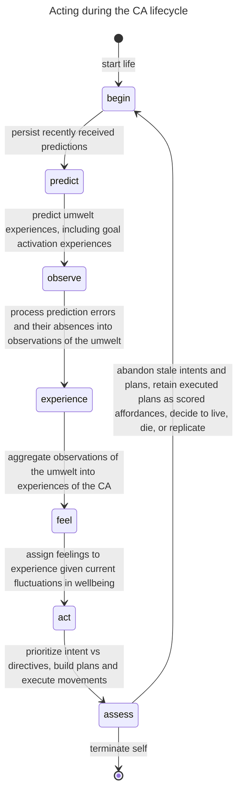
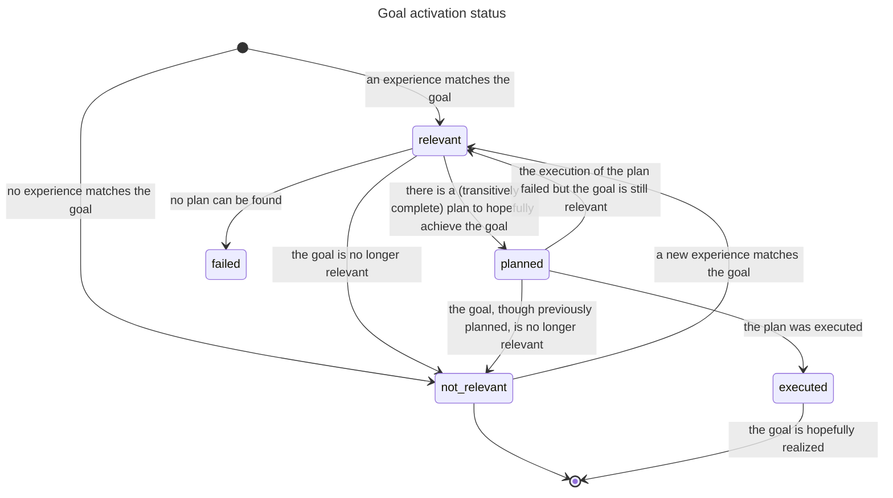

# Acting

## How Cognition Actors act

The mind of a robot is a collective of Cognition Actors (CAs) organizing themselves into an abstraction hierarchy as the robot learns how to survive.

Each Cognition Actor (CA) observes what lower-level CAs making up its umwelt are experiencing. The CA aggregates and integrates these observations into its own experiences and assigns a feeling to each one based on how its wellbeing is fluctuating.

> There are three kinds of CAs: sensor CAs -each with a body's sensor as its umwelt-, effector CAs -each with a body's effector as its umwelt, and dynamic CAs -CAs that have other CAs in their umwelt-.
Henceforth, CAs refers to dynamic CAs unless otherwise indicated.

A CA acts to improve how it feels by intending to terminate bad experiences and persist good ones. Over its lifetime, a CA gives itself goals to that effect (its intents, one at a time) and, to achieve them, makes and executes plans. A plan is a sequence of (sub)goals to be achieved by its umwelt. The CA delegates these sub-goals (a.k.a. directives) to its umwelt if it is composed of CAs. If the CA has effector CAs in its umwelt, it plans and issues commands (spin your wheel, etc.).

A CA thus acts by executing plans it builds to achieve a goal it gives itself (its intent), and to achieve goals assigned to it (directives) which compose the plans of parent CAs.

A CA triggers the recursive, stepwise execution of a plan to achieve its intent as soon as the plan is (transitively) ready to execute.
The recursive planning terminates with commands since commands require no further planning.

A command directs the activation of a body's effector (e.g. spin the left wheel once etc.) A plan that sequences commands embodies a "movement". All commands in a movement are meant to be executed at once.

A CA initiates actions by:

1. Giving itself the goal to impact a distinctly felt experience, i.t. it gives itself an intent
2. Assigning a priority to the intent based on the intensity of the feeling associated with the experience to be impacted
3. Finding a plan that is likely to produce the desired impact and to be carried out by its umwelt (with its sub-plans etc. down to effector commands)
4. Executing the plan (stepwise and recursively via sub-plans, down to command-defined "movements")

An executable plan is found by a CA only when, for each of the plan's directives (goals or commands to be achieved/executed), an executable plan is found in the CA's umwelt to achieve it.

At any point in time, there may be multiple CAs attempting to achieve their own intents. These attempts may get in each other's way. Such conflicts are minimized, if not resolved, by executing plans according to precedence. Precedence is determined by the hierarchical level of the owner of the causal intent (higher-ups matter more) and by the priority assigned to the achievement of the intent.
This prioritization is realized by predicting the realization of important goals before that of less important ones.

The CA eventually assesses whether the execution of a plan achieved its intended goal, or whether a goal or plan has become stale and should be abandoned. Executed plans are retained as affordances for later reuse, pre-empting building plans de novo. An affordance is scored according to the strength of the correlation between its execution and the achievement of its goal, and how recently they were last used (old affordances age out).

## Definitions

An *intent* is a self-assigned goal of the CA to impact one of its felt experiences.

A *goal*'s target is a relation/property experienced by a CA, to be impacted with some priority.

A *command* is an action (spin the wheel, reverse-spin the wheel, etc.) requested by a dynamic CA of an effector CA in its umwelt.

A *plan* is a prioritized sequence of goals or commands assembled by a CA to achieve either its own intent or a goal from a parent CA's plan (a directive).

A *movement* is a plan composed of commands to be executed all at once.

An *activation* is a property of a goal whose value is its status toward achieving the goal.

An *affordance* is a pre-built plan for achieving a stated goal, with an effectiveness score informing its reuse.

## Acting and the CA lifecycle

Aspects of acting happen throughout all phases of a CA's lifecycle.

The CA repeats its lifecyle in a loop for as long as it survives.
CAs higher up the hierarchy have longer lifecycles than lower-down CAs;
this gives a CA time to integrate information from its umwelt tasked with executing the CA's plans.

The lifecycle of a CA consists of these repeating **phases** defining the equivalent of an OODA loop:

`begin` -> `predict` -> `observe` -> `experience` -> `feel` -> `act` -> `assess` -> (and back to `begin`)

```mermaid
---
title: Acting during the CA lifecycle
---
stateDiagram-v2
  [*] --> begin : start life
  begin --> predict : persist recently received predictions
  predict --> observe : predict umwelt experiences, including goal activation experiences
  observe --> experience : process prediction errors and their absences into observations of the umwelt
  experience --> feel : aggregate observations of the umwelt into experiences of the CA
  feel --> act : assign feelings to experience given current fluctuations in wellbeing
  act --> assess : prioritize intent vs directives, build plans and execute movements
  assess --> begin : abandon stale intents and plans, retain executed plans as scored affordances, decide to live, die, or replicate
  assess --> [*] : terminate self
```

All phases of the lifecycle are involved in acting:

* The `begin` phase persists recently received predictions, including predictions about goal activations
* The `predict` phase is responsible for predicting the activation of directives planned by the CA (i.e. making activation predictions)
* The `observe` phase processes received activation prediction errors, and those not received, into activation observations
* The `experience` phase updates activation experiences from activation observations (by integrating the observations of activations of the directives of plans)
* The `feel` phase assigns a feeling to activation experiences, just as it does for all experiences
* The `act` phase is responsible for setting an intent, making and prioritizing plans for the intent and for parent directives, and executing them
* The `assess` phase is responsible for reviewing the success of goals and plans, and possibly dropping some because of staleness

Achieving a goal and the planned sub-goals it depends on requires coordination between a parent CA and its umwelt CAs, all of which are separate processes.
During any phase of its lifecycle, a CA can receive:

* activation predictions (predictions about the status of a parent plan directives) from its parents
  * to which it immediately responds with prediction errors if appropriate
* activation prediction errors from its umwelt, from activation predictions it made earlier,
  * about a directive being `not_relevant`, `relevant`, `planned`, `executed` or `failed`

Progressing toward the realization of a planned goal is entirely driven by

* predicting the activation statuses in the umwelt of planned directives as either `relevant`, `planned` or `executed`,
* reacting to receiving such predictions from parent CAs by possibly building or executing plans,
* or responding with prediction errors that give the actual goal activation statuses, including possibly `not_relevant`, and `failed`,
* and reacting to goal activation prediction errors by updating observations of directive activations by the umwelt, and updating experiences about the CA's own goals.

Once a CA stops making predictions about the status of a goal/directive, it implicitly signals to its umwelt that it is no longer interested in having it pursue the goal.
Predictions received persist, unless overridden, across a few lifecycles of a CA in order to match the longer lifecycles of its parents.
This is so a CA avoids interpreting the absence of recent activation predictions from its parents as an imeediate loss of interest in directives.
It is thus possible, for example, for a prediction received in lifecycle T to cause a prediction error to be sent back only in lifecycle T+1.

### Phases and acting

The CA manages the states of its active goals as activation experiences across all phases of its lifecycle.

During all phases, upon receiving an activation prediction, the CA:

* sends back nothing if the experienced status of the directive is as predicted
* otherwise
  * if the target of a directive's predicted activation does not correspond, or no longer corresponds, to any of its experiences
    * it sends back a `not_relevant` activation prediction error, and
    * forgets any goal activation experience and plan about the directive (may be it had such an experience previously but no longer does)
  * else
    * if the directive is new, it creates an activation experience with status `relevant` to track its progress

At the `begin` phase, a CA:

* Persists goal activation predictions received during the approximate timeframe of parent CAs
  * So that signal received by a CA that a parent is interested in a directive persists for the duration of a parent CA's timeframe

During the `predict` phase, a CA:

* Emits activation predictions to its umwelt for all directives in an active plan
  * A plan is active if the directives in it are neither all `executed` nor all `failed`
  * An activation prediction about the directive is sent to each CA in the umwelt with value:
    * `executed` to cause the execution of plans the umwelt built to achieve the directive
      * but only if
        * all directives in it are observed as `planned` and
        * the planned goal is an intent or
        * the planned goal is a received directive predicted as `executed`
    * `planned` to cause the directive in the plan to themsleves be planned by the umwelt
      * but only if all directives in the plan are observed as `relevant` or `planned` (but not all planned)
    * `relevant` to otherwise validate that the directive is (still) meaningful to the CA's umwelt

During the `observe` phase, a CA:

* Aggregates into activation observations (one per goal/directive) the activation prediction errors received from the umwelt
  * Prediction errors about the activation of a given directive are aggregated into a single observation with value:
    * `failed` if the entire umwelt sent back prediction errors correcting to `failed`
    * else `not_relevant` if the entire umwelt sent back prediction errors correcting to `not_relevant`
    * else `executed` if any prediction error corrects to `executed` (only one umwelt CA needs experience the directive as executed for the CA to observe the directive as executed by the umwelt)
    * else `planned` if any prediction error corrects to `planned` (similarly, only one umwelt CA needs experience the directive as planned for the CA to observe the directive as planned by the umwelt)
    * else `relevant` if any prediction error corrects to `relevant`
* Aggregates uncontradicated activation predictions into activation observations
  * One per goal activation, with value determined as above

During the `experience` phase, a CA:

* Updates activation experiences about is own goals (its own intent and the directives it received), from its observations of umwelt directive activations
  * An activation experience for a CA's goal updates to status
    * `failed`
      * if, for all directives in the CA's plan for the CA's goal, their activations are observed as `not_relevant` or `failed`
    * else `executed`
      * if, for all directives in the CA's plan for the CA's goal, their activations are observed as `executed`
    * else `planned`
      * if, for all directives in the CA's plan for the CA's goal, their activations are observed as `planned` or `executed`
    * else it keeps the current status

The are thus two levels of aggregation:

1. Aggregating observations of the activations of a directive by the umwelt CAs into one observation by the CA (e.g. a CA's directive is observed by the CA as executed if any umwelt CA experiences it as executed)
2. Aggregating the observed activations of all directives in a plan into the experienced activation of the plan's goal (e.g. the planned goal is experienced as if all directives in the plan is observed as executed)

During the `act` phase, a CA:

* Gives itself an intent (to impact the most felt experience), assigns it a priority, and immediately experiences it as `relevant`
  * but only if it has none already
* For its intent and each (relevant) directive for which it received a `planned` activation prediction, the CA
  * reuses an affordance as the goal's plan
  * or builds a plan if none exists
* A plan is executed if the plan is experienced as `planned` and
  * the plan's goal is an intent
  * the plan's goal is a directive and the directive is predicted as `executed`
* If a plan to execute is a movement (i.e. its directives are commands)
  * the movement is executed by
    * requesting all commanded effector CAs to prepare actuations
    * telling the body to execute prepared actuations at once
    * each executed command becomes an immediate (unpredicted) **observation** of an actuation with
      * origin: object{type: `effector`, id: EffectorName}
      * kind: `actuation`
      * value: Action (`spin`, `reverse_spin` etc.)
  * the goal activation is immediately experienced as `executed`
* If a plan to execute is made up of directives (goals that are not commands)
  * each directive is predicted as `executed` if no directive precedes it in the plan that is not experienced as `executed`

See [planning.md](./planning.md) about building plans.
  
At the `assess` phase, a CA:

* Determines if its intent is stale or no longer the most urgent
  * If so
    * the CA abandons the intent
    * and drops any plan it was building for it
    * and forgets the intent's activation experience
* Determines if a received directive is stale
  * It is stale if no prediction about its activation was recently received (i.e no parent apparently cares anymore)
  * If stale
    * the CA drops any plan for it
    * and forgets the directive's activation experience
* Determines if a plan is stuck
  * It is stuck if
    * the plan's goal is experienced as `failed`
    * or the plan is stale (it was created too many timeframes ago and its goal is no yet experienced as `executed`)
  * If stuck,
    * the plan is dropped
    * and the plan's goal activation is now experienced as only `relevant` ("back to square one")
* Determines the effectiveness of affordances
  * Add all executed plans to the CA's affordances (no duplication)
    * A plan is executed if its goal activation is experienced as `executed`
  * Update the score of all affordances as a combination of goal achievement correlation and of its "freshness"
    * If the plan's goal is achieved, correlation is inversely proportional to delta time between goal achievement and plan execution
      * The maximum correlation value is retained
    * Freshness decreases with time elapsed since last executed
  * Drop affordances that age out

  See [assessing.md](./assessing.md)

## Action-related states

Each CA independently manages its own changing state.

For a dynamic CA (any CA other than a sensor or effector CA), the data composing this state captures, in the current and in remembered timeframes,
what the CA has observed, experienced, felt etc. as well it intent, the plans it built, and the affordances it discovered.

An effector CA need only manage the actuation readiness of received commands in communication with the body.
  
### Goal activation status

The status of a goal activation (observed or experienced) indicates where it is in its progression toward, hopefully, being achieved, including the possibility of having reached a dead end.

The possible statuses are:

* `relevant` - the goal was found to relate to one or more experiences of the CA
* `not_relevant` - the goal (its target) does not relate to any current experience
* `planned` - a plan exists fully fleshed out to (hopefully) achieve the goal
* `executed` - the plan for the goal was executed
* `failed` - no working plan can be found or executed for the goal

```mermaid
---
title: Goal activation status
---
stateDiagram-v2
    [*] --> relevant : an experience matches the goal
    [*] --> not_relevant :  no experience matches the goal
    not_relevant --> [*]
    relevant --> planned : there is a (transitively complete) plan to hopefully achieve the goal
    relevant --> failed : no plan can be found
    relevant --> not_relevant : the goal is no longer relevant
    not_relevant --> relevant : a new experience matches the goal
    planned --> executed : the plan was executed
    planned --> relevant : the execution of the plan failed but the goal is still relevant
    planned --> not_relevant : the goal, though previously planned, is no longer relevant
    executed --> [*] : the goal is hopefully realized
```  

### Relevant state properties

The state of a dynamic CA consist of many properties, including the following the CA uses to manage acting, i.e. making progress on its goals, self-assigned or received:

* `predictions_in`- Predictions received from parent CAs about the activations of their directives (delegated goals)
* `predictions_errors`- Prediction errors received from umwelt CAs about goal activation predictions the CA made
* `observations` - The observed activation status of each directive sent to the umwelt
* `experiences` - The experienced activation status of the CA's intent and of each goal delegated to it by a parent (a.k.a. directive)
* `intent`- The CA's current intent (self-assigned goal)
* `plans` - All the plans the CA built to achieve its intent and received directives
* `affordances` - All recently executed plans scored for their effectiveness at achieving their goals

### Data structures specific to acting

How goals, commands, plans, and affordances are represented:

#### `goal{target: Target, impact: Impact, priority: Priority, intent_level: Level}`

> **Target**: `target{origin: Origin, kind: Kind, value: Value}` - the state of an observed/experienced property/relation to be impacted
>
> **Impact**: `create` | `persist` | `terminate`
>
> **Priority**: 0.0..1.0 - How important is achieving the originating intent
>
> **Level**: The level of the CA who's intent transitively led to this goal (goal precedence is a function of priority and intent level)

#### `plan{goal: Goal, directives: [Directive, ...]}`

> **GoalID**: The id of the goal this plan is for
>
> **Directive**: goal{} or command{}

#### `command{effector_ca: Effector_ID, action: Action}`

> **Effector_ID**: the ID of the effector commanded to take the action
> **Action**: the name of the action, e.g. `spin` or `reverse_spin`, etc.

#### `affordance{plan: Plan, score: Score}`

> **Plan**: plan{...}
>
> **Score**: 0.0..1.0 | none
