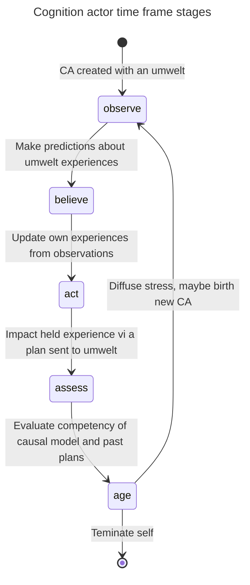

# Cognition actors

A CA strives to become increasingly competent at surviving by making sense of its umwelt and taking actions beneficial to its wellbeing.

A CA makes sense of its umwelt (a few lower-level CAs) by predicting changes to it (i.e. predicting incoming observations of its umwelt CAs' experiences)
and by abstracting experiences from observations of its umwelt. Its experiencesn become observations available to parent CAs (higher-level CAs that have the CA in their umwelts).

A CA is effective at impacting its umwelt if it has reliable affordances it can apply to validate pleasant experiences or invalidate unpleasant experiences.
An experience is pleasant if it was derived in the context of high or improving wellbeing, unpleasant in the context of low or worsening wellbeing

The more competent a CA is, the more likely it is that its parents CAs will be competent and survive, and thus the more likely it is that the CA itself will survive; orphaned CAs are susceptible to removing themselves when wellbeing is consistently low.

## Types of cognition actors

There are two broad types of cognition actors, dynamic CAs and static CAs.

Static CAs -sensor CAs and effector CAs- are determined a priori by the sensors and effectors that are on the agent's body. They populate the bottom layer of the SOM and persist throughout the life of the SOM.

Dynamic CAs populate all other layers of the SOM and are added and removed throughout the life of the SOM as the agent searches the space of SOM configurations for one that, at the very least, keeps it alive.

Dynamic CAs have umwelts and they have causal theories to make sense of their observations of their umwelts. A static CAs have neither.

## Timeframe and memory

A CA operates one timeframe after another. The current timeframe of a CA corresponds to a "thick now"; all observations made and all experiences abstracted by the CA during this timeframe are considered synchronous. Timeframes are not synchronized across CAs. The timeframe of a CA starts and stops independently of those of other CAs. The current timeframes of CAs partially and randomly overlap.

During its current timeframe, a CA makes new observations by predicting the latest experiences of CAs in its umwelt, updating its wellbeing measures, refreshing its set of experiences by integrating the latest observations with past ones, and assigning up-to-date normative values (pleasantness/unpleasantness) to its current experiences.

At the end of the current timeframe, a CA decides whether to act on its updated experiences and, if so, how.

Upon completing its current timeframe, a CA adds the state of the timeframe to its memory of past states. The CA uses its remembered past states to compute its wellbeing gradients, derive its current (pleasant vs unpleasant) experiences, and update the causal theory that explains its past observations and predicts its incoming observations.

There is a "metabolic" cost associated with memory. The higher a CA's metabolic costs, the faster its fullness wellbeing drains. A CA under stress from low fullness might reduce the size of its memory to reduce this drain. Regaining high fullness would restore the prior bound on the CA's memory size.

CAs higher up in the collective's hierarchy have qualitatively longer timeframes and longer memories (more states are remembered). They are also a greater draw on fullness.
When the maximum number of remembered states is reached and the latest state is committed to memory (upon completion of the current timeframe), the oldest state is dropped from memory.

## Observing (its umwelt's experiences)

* A (dynamic) CA predicts its observations of the experiences of CAs in its umwelt
  * A CA begins life with an empty causal theory that predicts random, domain-bounded observations or prior observations.
  * If the CA has a causal theory, it uses it to predict the next observations.
* A CA predicts the success of its plans using its causal theory. It also remembers the effecticeness of previously executed plans.
* If a prediction is met with a prediction error, the prediction error becomes the latest observation, else the uncontested prediction is the observation.
* A CA drops repeated states (state = observations in the same timeframe) - i.e. a CA's perceived time stands still while its umwelt does not appear to change.

## Understanding (relating observations causally and via constraints)

* To be competent, a CA needs to make sense of its observations via a causal theory of
  * how its umwelt changes on its own
  * how its umwelt changes from the CA executing plans
* A CA requests a causal theory from the Apperception Engine when
  * it has no theory and a theory could be generated from its remembered states
  * it has a theory and its predictive capabilities have degraded since acquired such that it is no longer good enough
  * it has a theory but has had new plans executed since the theory was generated

* A CA's causal theory makes causal sense of experiences observed in its umwelt
  * necessary co-occurrences of observations from static rules
    * if a static rule states "A whenever B and C:, then observing B and C at time T infers (deductively) observing A also at T
    * e.g if the proximity got smaller then the ambient light must also have gotten brighter
  * sequencing of observations from causal rules
    * if a causal rule states "A after B and C", then
      * observing A at time T entails (abductively) B and C at T-1
      * having observed B and C at T-1 entails (deductively) A at time T
    * e.g. the color will become gray if the color is green and both wheels spin

* The CA applies the theory's causal rules to predict the next state so it can predict umwelt experiences
  * from the considered execution of an plan selected to achieve an intent (impacting a held experience)
  * due to "spontaneous" changes in the umwelt

* Up-down and down-up constraints
  * The parent CAs constrain the vocabulary of a CA's causal theory (how the CA can express a symbolic generative model), should the CA look for a better one
    * by constraining the umwelt CAs' experience domains to cover the umwelt experiences used by the parent to abstract its own experiences
  * Umwelt CAs constrain the space of experiences of their parent CAs
    * By constraining what the parent CAs's experiences can be derived from

## Believing (detecting patterns of change in observations)

* A sensor CA has atomic experiences obtained from sensor readings
* A non-sensor CA gets its experiences
  * from experiences elevated transitively from its umwelt
  * from composing observed, umwelt experiences into abstract experiences

* See [experiences.md](./experiences.md)

## Acting (on experiences)

* A CA seeks to validate a pleasant experience and invalidate an unplesant experience
  * By furthering or interrupting (i.e. impacting) sub-experiences via intents delegated to umwelt CAs
* Realizing an intent is recursive because an experience is a recursive structure of experiences held by umwelt CAs

* See [plans.md](./plans.md)

## Attention

* An experience, when synthesized, is associated with a wellbeing/pleasantness trend (better, worse, same)
  * A CA remembers the ambient wellbeing at each timeframe
* A CA normally does not intend to further/disrupt experiences when wellbeing trends not far enough from neutral
* Higher-level experiences are more likely to be associated with clear wellbeing trends than lower-level experiences
  * This drives the SOM to add levels until clear wellbeing trends appear
  * Afforded control over wellbeing makes up for the higher resource consumption of added SOM levels

## Wellbeing

* It starts life with half the fullness of its mitotic progrnitor, full integrity and no engagement
* A CA updates its wellbeing measures (fullness, integrity and engagement)
  * They are restored/depleted by the actions of the agent and by the passage of time
  * Wellbeing is osmotically equilibrated among CAs over parent-umwelt links

* See [wellbeing.md](./wellbeing.md)

## The lifecycle of a cognition actor

The lifecycle of a dynamic CA (sensor and effector CAs are static) is a sequence of time frames. Each time frame goes through stages driven by messages the CA sends itself to progress from one to the next.

The lifecycle of a dynamic CA ends when the CA decides to terminate itself.

At any stage in a time frame, the CA immediately processes all events and messages from other CAs and updates its state.

The stages of a time frame are:

observe -> Make predictions about umwelt experiences -> believe
believe -> Update own experiences from observations -> act
act -> Select a goal (a held experience to impact) and attempt to realize it via an plan directing the umwelt to change its experiences -> assess
assess -> Evaluate the accuracy of the causal model and the effectiveness of past plans -> age
age -> Maybe grow/shrink the SOM (cytosis/apoptosis) and diffuse stress -> observe

The pattern is *Message to self -> Task -> Follow-up message to self*

Executing a time frame stage:

1. Receive a "start stage" message from itself with an updated state
2. Merge the current state with the updated state
3. Start a timeboxed, asynchronous task for this stage with the new state
4. The task may emit events and messages to other CAs
5. On ending the task (b/c its done or time has expired),
   send the next stage message to self with the modified state
