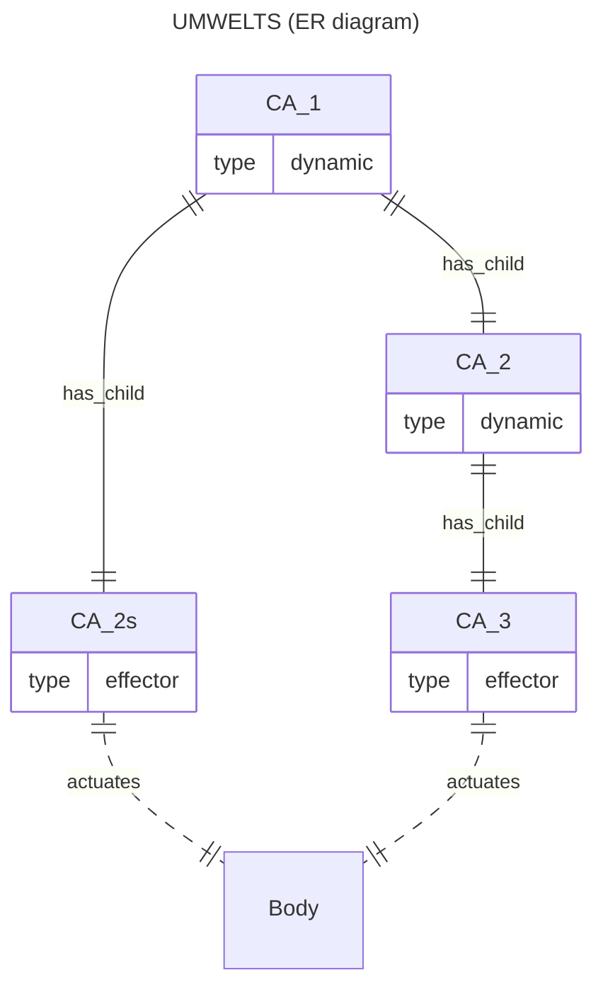
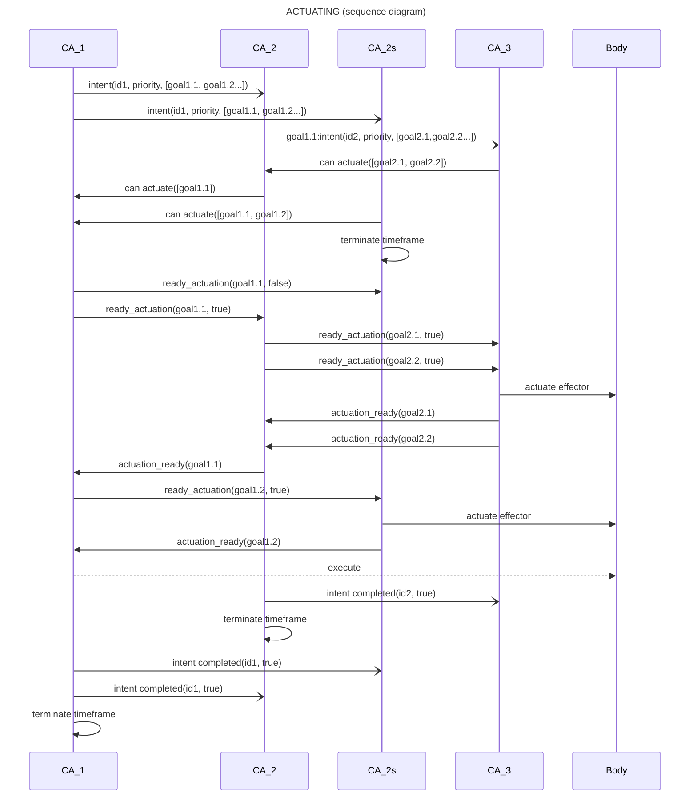

# Plans

A Cognition Actor (CA) seeks, through the execution of plans, to persist pleasant experiences it holds and to terminate its unpleasant experiences.

## Recap

A CA is part of a hierarchichal collective of CAs that animate an agent. Each CA has an umwelt composed of a small number of CAs from the (abstraction) layer below.

A CA synthesizes its experiences from its observations, past and current, of the experiences in its umwelt. It observes by predicting umwelt experiences and receiving prediction errors when the predictions are wrong.

The experiences of a CA exist in the context of wellbeing measures, current and trending. The wellbeing measures are fullness (energy), integrity (health) and engagement (relevance). They signal risks, present or absent, growing, steady or decreasing, to the survivability of a CA and, possibly and transitively, the entire collective of CAs.

Experiences associated with high or growing risks are unpleasant. Experiences associated with low or decreasing risks are pleasant. Others are neutral. A CA acts on its umwelt in response to the pleasantness or unpleasantness of its current experiences.

A CA operates one timeframe after another. Each timeframe corresponds to a "thick now". The timeframe of a CA starts and stops independently of other CAs; timeframes are not synchronized. CAs higher up in the collective's hierarchy have qualitatively longer timeframes.

During its current timeframe, a CA observes the latest experiences in its umwelt (via predictions made and prediction errors received), reads the wellbeing measures "diffused" by other CAs, refreshes its set of experiences by integrating its latest observations with past ones, and assigns up-to-date normative values (pleasantness/unpleasantness) to its updated experiences.

At the end of the current timeframe, a CA decides whether to act on updated experiences and, if so, which ones, to what effect, and how.

## Intents

A CA *intends* to take action to impact its experiences; an intent is not guaranteed to be realized. After all, a CA participates in a collective and there is only one body that the collective animates. Simultaneous intents to alter experiences coming from multiple CAs must be resolved so that only courses of action with the highest priority are carried out by the agent at any time.

An intent by a CA consists of

* a goal - an experience held by the CA and a desired impact on it, i.e. the persisting of a pleasant experience, or the termination of an unpleasant experience
* a priority - determined by the graded normativity of the experience targeted by the intent
* a plan - how to achieve the goal by impacting (initiating, persisting, terminating) the observed experiences held by the umwelt CAs from which the targeted CA's experience was synthesized

A CA's plan is a list of directives, to be communicated to the umwelt CAs, to achieve the CA's goal. 

A **directive** is a delegated, goal (an experience of umwelt CAs to impact) to be achieved by the umwelt *however it chooses*.

The priority of a plan reflects how unpleasant/pleasant the experience to impact is. Generally a directive from a high-level CA will have greater priority than that of a lower-level CA, but not always; low level CAs facing an "emergency" can override the plans of higher-level CAs.

The plan's directives are communicated all at once by the CA to its umwelt at the end of the CA's current timeframe. Keep in mind that, at any point in time, multiple CAs may be intending to act.

## Attention and action thresholds

The first step by a CA when preparing to act is to identify an experience to attend to, even if a parent CA has already directed the CA to impact some of its own choosing.

Only abstract (composite) experiences can be acted on and impacted, namely `count`, `more` and`trend`. Concrete experiences, those from sensor and effector CAs, and those imagined by a causal theory, represent "givens" that can not be changed though actions.

Which actionable experience is identified depends on its pleasantness/unpleasantness and whether or not it is *sufficiently* pleasant or unpleasant (activation threshold) for the CA to pay attention to it. The activation threshold is set by the current wellbeing of the CA which propagates "osmotically" throughout the entire collective.

In a low fullness context (depleted energy stores), a CA raises the threshold for action (conserve energy!), whereas, when energy is plentiful and agent engagement is low, a CA lowers the threshold for action (try something, anything!). Only an experience with normativity (pleasantness/unpleasantness) above the dynamic threshold is attended to and deemed worthy of action.

The normativity of an experience is set as a combination of absolute wellbeing values and their gradient. A positive wellbeing value is pleasant unless it is falling sharply; then it's unpleasant. Similarly, a negative wellbeing value is unpleasant unless it is rising sharply; then it's pleasant.

The CA selects which experience, if any, is *most worthy* of action in the current timeframe. Invalidating an unpleasant experience it cares about takes precedence over validating a pleasant experience. Typically, the CA will intend to terminate the most unpleasant, action-worthy experience. Else it will intend to persist the most pleasant, action-worthy experience, or iy may do something random (babble) if there is no action-worthy experience and fullness is high and steady/rising.

## Constructing a plan

A CA builds a plan when it has identified an experience it holds that need impacting, or when it receives a higher priority plan (a set of directives) from a parent CA. When receiving directives "from above", it determines which goals are relevant to it; the others are likely relevant to sibling CAs participating in the same umwelt.

Goals name umwelt experiences and the desired impacts (initiate, persist or terminate). It is *entirely* up to the goal-receiving umwelt CA to construct a plan for the experiences it wants to or has been requested to impact.

Once a CA has identified (or been told by a parent CA of) an experience to initiate, persist or terminate, the CA must determine its own plan to achieve this goal. The composition of the plan depends on the type of experience and on the desired impact (initiate/persist/terminate). The plan's priority depends on the CA's wellbeing (value and gradient) if originating with the CA, or on the priority of the received directive.

How to impact an experience depends on how it was arrived at. A constructed (aka abstract) experience is composed of observations (its base of support) which are themselves experiences once or currently held in the CA's umwelt. To impact an experience a CA holds, the CA needs to impact supporting experiences held in its umwelt.

A CA always owns a causal theory. At first, it is a trivial one that predicts what it already observed ("it is what it is"), or predicts randomly if it has yet to make observations. At some point, the CA ask sthe Apperception Engine for a causal theory informed by its history of observations of its umwelt.

The CA can use its causal theory to predict changes to the experiences of its umwelt (i.e. incoming observations) as a result of realizing directives. This can be put to use when constructing a plan.

A causal theory has three kinds of rules

* Constraints: What is expected *never* to be observed simultaneously - e.g. not (A and B) now
* Static rules: What is expected to *always* be observed simultaneoulsy - e.g. if A and B and then also C now
* Causal rules: What is expected to be observed *next* given what was observed previously - e.g. A and B then C next

An additional but implied rule is that a previous observation survives as a current observation if it does not contradict any constraint or static rule.

A trivial causal theory has empty sets of all three kinds of rules, yielding a trivial "it is what it is" causal theory.

A CA's abstract experience integrates multiple observations (predicted experiences in the CA's umwelt), either within the bounds of the current timeframe (`count`, and `more` experiences)
or of past *and* current timeframes (`trend` experiences).

The observed umwelt experiences involved in the composition of an abstract experience constitute the base of support of that experience. To impact an abstract experience it holds, a CA directs its umwelt to impact experiences from which the held experience is derived and perhaps also to initiate new experiences.

Since observations by the CA are experiences held in the umwelt of the CA, one can see how acting becomes a recursive operation that will unfold across multiple layers of CAs and over multiple CA timeframes, until effector CAs (on the lowest level of the hierarchy of CAs) become involved and the agent's relationship with its environment is modified by running mototrs etc.

The task of constructing a plan -in order to impact an experience held by the CA- consists in deciding which supporting and observed umwelt experiences to impact and how.

There will likely be different combinations of supporting experiences that could be impacted and thus there could be many alternate plans to choose from.

The causal theory, a model of the generative processes causing these observations, informs the CA in the construction of hopefully effective plans by anticipating their consequences.

To recap, the CA can seek to impact an experience it holds by impacting supporting experiences held in its umwelt.
This is achieved indirectly by the CA directing its umwelt to find a way to impact these supporting experiences in prescribed ways (initiate vs persist vs terminate).

The only types of experiences that can be impacted are `count`, `more` and `trend` experiences.
Concrete experiences -sensing, action taken or imagined- can not be impacted; they are givens.

A sensing experience (e.g. distance(ir_sensor_1, 10)) is a record of a sensor reading already taken. There is no point denying it. The same applies to action experiences (e.g. spin(motor_1, true)). There is also no point in denying it happened. An imagined experience is one abduced by the Apperception Engine to unify a causal theory. It must be accepted for as long as the causal theory is being used.

Since abstract experiences are composed of experiences observed in the umwelt which can themselves be abstract experiences, a plan might be realized by more (lower-level) plans and so on until we reach only goals that can be directly impacted by activating effectors.

A CA seeking to impact an umwelt experience supporting an experience it holds can do so *directly* or *indirectly*.

### Directly impacting an experience

How a CA might **directly** impact a held experience is modulated by the kind of experience it is.

#### Impacting a `count` experience

A `count` experience encapsulates how many of a given kind of experiences observed in its umwelt there are (for e.g., this motor was spun once).

To persist a count experience, a CA's plan would direct its umwelt CAs to persist *all of* the counted (observed) experiences.

To initiate or terminate a count experience, a CA's plan would direct its umwelt CAs to to add a counted experience or terminate *any of* the counted experiences.

#### Impacting a more experience

A `more` experience expresses that there is more of than another in its umwelt.

To initiate or teminate a more experience, a CA's plan would direct its umwelt to initiate or to terminate a compared, count experience.

To persist a more experience, a CA's plan would direct its umwelt CAs to persist both compared counts.

#### Impacting a trend experience

A `trend` experience captures how a given kind of observed experience is changing across the latest timeframes of the CA, for example, "distance keeps diminishing" is a "down" trend.

To initiate a trend experience, a CA's plan could change the ordinal value of the trending umwelt experience.
To persist a trend experience, a CA's plan would direct its umwelt to **further** the trend.
To terminate a trend experience, a CA's plan would direct its umwelt to **disrupt** the trend.

How a trend experience is impacted depends on the assigned value of the trend (up, down, same or ended).

An `up` trend captures an upwardly changing ordinal value for a given property of a given object.
A `down` trend captures a downwardly changing ordinal value for a given property of a given object.
An `ended` trend captures an unknown ordinal value for a given property of a given object after it trending.

If the nature of the trend to impact is

* up
  * to disrupt it, reduce or stabilize the values of the observed, trending experience
  * to further it, increase the values of the observed, trending experience
* down
  * to disrupt it, increase or stabilize the values of the observed, trending experience
  * to further it, decrease the values of the observed, trending experience
* same
  * to disrupt it, increase or decrease the values of the observed, trending experience
  * to further it, maintain the values of the observed, trending experience
* ended
  * to disrupt it, cause a value for the previously observed, trending experience
  * to further it, keep unknown the value of the previously observed, trending experience

### Indirectly impacting an experience given a causal theory

A CA can impact an experience A **indirectly** by impacting a *causally linked*, observed experience B.

* if A and B are mutually exclusive (according to the CA's causal theory) then
  * initiating B should terminate A
  * persisting B should prevent A
  * terminating B should allow for A
* if A and B must co-exist under some condition then
  * initiating B should initiate A
  * persisting B should persist A
  * terminating B should terminate A
* if B causes A under some condition then
  * initiating B should eventually initiate A
  * persisting B should persist or eventually initiate A
  * terminating B *might* terminate A

## Executing a plan

A plan is a set of directives to be realized by a CA's umwelt in order to impact an experience held by the parent CA.

A directive is a prioritized goal meant by the CA for its umwelt, a goal being an observed experience plus its desired initiation, continuation or termination (the umwelt is free to formulate an appropriate plan).

If the the CA is an *effector CA*, the goals it receives will simply be to activate effectors, like spinning a wheel forward or backward a number of times. Effector CAs are at the bottom level of the hierarchy of CAs and are indirectly and transitively in the umwelts of every CAs. A plan is thus ultimately realized via cumulated actions taken by effector CAs.

A CA executes a plan it formulates or has received at the close of its current timeframe, once it has made new observations and updated its experiences from them.

### Observing action experiences from executed plans

When a CA executes a plan it formulated, the execution of the plan possibly becomes a set of `Action(Effector, Boolean)` experiences (a.k.a. action experiences) held by effector CAs sitting at the bottom of the CA hierarchy.

These action experiences held by effector CAs are automatically elevated up the hierarchy, becoming experiences shared by ancestor CAs, subject to consistency constraints (no disagreement among siblings) and abstraction constraints (they are not combined into abstract experiences).

Crucially, the action experiences from the execution of the plan, like any other umwelt experiences observed by a CA, can become incorporated into the CA's causal theory when it is updated.

### Evaluating the success of reusable plans

The CA remembers, for a while, a plan it executed and why (the goal -the experience to impact- and the directives emitted) together with the wellbeing values at the time, so as to later be able to gauge the success of the plan.

A plan is deemed successful if it precedes closely the intended experience change. It is even more successful if it correlates with an increase in wellbeing. The CA remembers a successful plan and its goal as an affordance,

A CA might try pre-built affordance, or it might even construct a new plan, all depending on the stress felt by the CA from changes in its wellbeing.

### Execution protocole

* CAs may receive intent events during their open timeframes (intents received when a timeframe is closed but not ended are accumulated and given to the next timeframe when it opens)
* At the close of its timeframe, a CA produces its own self-serving goals, prioritize them and compare priorities with the received intents
* A CA selects either a received intent it can help realize, or a self-assigned goal it intends to realize
  * The CA allocates an amount to time in which to try to realize the received intent or the self-assigned goal
  * If a self-assigned goal is selected
    * The CA builds/reuses a plan to realize it and emits an intent with the plan directives and a priority
    * It messages the parents that sent intents that the intended goals can not be actuated
  * If a received intent is selected
    * For each goal matching an experience it holds
      * It builds/reuses a plan and emits an intent
    * The child CA tells the intending parent CA that what goals it can actuate
* When the intending CA hears from all child CAs about all actualizable goals in the intent it emitted
  * If any intended goal can not be actuated by any child CA, then the intent can not be realized
    * The CA emits that the intent completed in failure
    * The CA looks for an alternative plan unless time allotted is expired
  * If all intended goals can be actuated
    * For each such goal
      * The CA select one child CA who can actuate and tells it to ready actuation
        * It tells the others not to actuate
    * Once all selected CAs have reported that they have readied actuation
      * If the CA originated the intent from a self-selected goal, it tells the body to execute readied actuations
      * Else if the intent was to realize a received goal (as a directive in an intent from a parent CA)
        * Tell the parent CA that the received intent's goal actuation is readied

### Actuation flow

Let's assume:

* CA_3 is in the umwelt of CA_2.
* CA_2 and CA_2s are in the umwelt of CA_1.

### Timeframe termination

* If a CA emits an intent, it terminates its timeframe once its intent is completed.
* A CA that received an intent but did not emit one, terminates its timeframe once it confirmed which goals it could actuate.
  * The potential actuations are retained into the new timeframe awaiting readying requests.
    * It is possible that, by the time, a CA receives a readying request, its experiences have shifted and the actuation is obsolete.
    * This is disregarded and the actuation is nonetheless readied.
* A CA that did not receive an intent nor emitted one terminates its current timeframe immediately.
