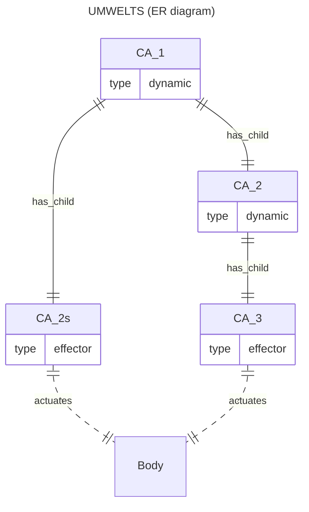
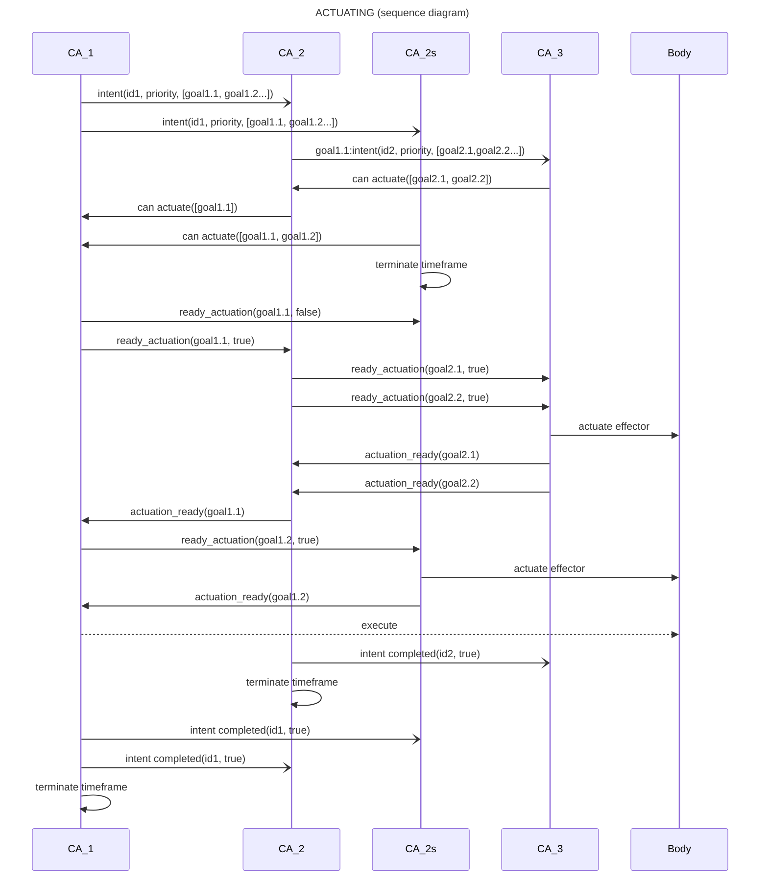

# Old notes about plans

## Recap

A CA is part of a hierarchichal collective of CAs that animate an agent. Each CA has an umwelt composed of a small number of CAs from the (abstraction) layer below.

A CA synthesizes its experiences from its observations, past and current, of the experiences in its umwelt. It observes by being informed of activations (actions/directives executed), and by predicting umwelt experiences and receiving prediction errors when the predictions are wrong.

The experiences of a CA exist in the context of wellbeing measures, current and trending. The wellbeing measures are fullness (energy), integrity (health) and engagement (relevance). They signal risks, present or absent, growing, steady or decreasing, to the survivability of a CA and, possibly and transitively, the entire collective of CAs.

Experiences associated with high or growing risks are unpleasant. Experiences associated with low or decreasing risks are pleasant. Others are neutral. A CA acts on its umwelt in response to the pleasantness or unpleasantness of its current experiences.

A CA operates one timeframe after another. Each timeframe corresponds to a "thick now". The timeframe of a CA starts and stops independently of other CAs; timeframes are not synchronized. CAs higher up in the collective's hierarchy have qualitatively longer timeframes.

During its current timeframe, a CA observes the latest experiences in its umwelt (by receiving activation events and via predictions made and prediction errors received), reads the wellbeing measures "diffused" by other CAs, refreshes its set of experiences by integrating its latest observations with past ones, and assigns up-to-date normative values (pleasantness/unpleasantness) to its updated experiences.

At the end of the current timeframe, a CA decides whether to act on updated experiences and, if so, which ones, to what effect, and how.

## Intents

A CA *intends* to take action to impact its experiences; an intent is not guaranteed to be realized. After all, a CA participates in a collective and there is only one body that the collective animates. Simultaneous intents to alter experiences coming from multiple CAs must be resolved so that only courses of action with the highest priority are carried out by the agent at any time.

An intent by a CA consists of

* a goal - an experience held by the CA and a desired impact on it, i.e. persisting an experience that feels good, or the termination of an experience that feels bad
* a priority - determined by the graded normativity of the experience targeted by the intent
* a plan - how to achieve the goal by impacting (initiating, persisting, terminating) the observed experiences held by the umwelt CAs from which the targeted CA's experience was synthesized

A CA's plan is a list of directives, to be communicated to the umwelt CAs, to achieve the CA's goal.

A **directive** is a delegated goal (an experience of umwelt CAs they are asked to impact). A directive is to be achieved by the umwelt *however it chooses*.

The priority of a plan reflects how unpleasant/pleasant the experience to impact is. Generally a directive from a high-level CA will have greater priority than that of a lower-level CA, but not always; low level CAs facing an "emergency" can override the plans of higher-level CAs.

The plan's directives are communicated all at once by the CA to its umwelt at a dedicated phase of the CA's current timeframe. Keep in mind that, at any point in time, multiple CAs may be intending to act.

## Attention and action thresholds

The first step by a CA when preparing to act is to identify an experience to attend to, even if a parent CA has already directed the CA to impact some of its own choosing.

Only synthetic experiences can be acted on and impacted, namely `count`, `more` and`trend`. Activation experiences and concrete experiences, those from sensor CAs, as well as those imagined by a causal theory, represent "givens" that can not be changed directly by intending to.

Which actionable experience is identified depends on its pleasantness/unpleasantness and whether or not it is *sufficiently* pleasant or unpleasant (activation threshold) for the CA to pay attention to it. The threshold is set by the current wellbeing of the CA which propagates "osmotically" throughout the entire collective.

In a low fullness context (depleted energy stores), a CA raises the threshold for action (conserve energy!), whereas, when energy is plentiful and agent engagement is low, a CA lowers the threshold for action (try something, anything!). Only an experience with normativity (pleasantness/unpleasantness) above the dynamic threshold is attended to and deemed worthy of action.

The normativity of an experience is set as a combination of absolute wellbeing values and their gradient. A positive wellbeing value is pleasant unless it is falling sharply; then it's unpleasant. Similarly, a negative wellbeing value is unpleasant unless it is rising sharply; then it's pleasant.

The CA selects which experience, if any, is *most worthy* of action in the current timeframe. Invalidating an unpleasant experience it cares about takes precedence over validating a pleasant experience. Typically, the CA will intend to terminate the most unpleasant, action-worthy experience. Else it will intend to persist the most pleasant, action-worthy experience, or iy may do something random (babble) if there is no action-worthy experience and fullness is high and steady/rising.## Executing a plan

A plan is a set of directives to be realized by a CA's umwelt in order to impact an experience held by the parent CA.

A directive is a prioritized goal meant by the CA for its umwelt, a goal being an observed experience plus its desired initiation, continuation or termination (the umwelt is free to formulate an appropriate plan).

If the the CA is an *effector CA*, the goals it receives will simply be to activate effectors, like spinning a wheel forward or backward a number of times. Effector CAs are at the bottom level of the hierarchy of CAs and are indirectly and transitively in the umwelts of every CAs. A plan is thus ultimately realized via cumulated actions taken by effector CAs.

A CA executes a plan it formulates or has received at the close of its current timeframe, once it has made new observations and updated its experiences from them.

### Observing action experiences from executed plans

When a CA executes a plan it formulated, the execution of the plan possibly becomes a set of `Action(Effector, Boolean)` experiences (a.k.a. action experiences) held by effector CAs sitting at the bottom of the CA hierarchy.

Crucially, the action experiences from the execution of the plan, like any other umwelt experiences observed by a CA, can become incorporated into the CA's causal theory when it is updated.

### Evaluating the success of reusable plans

The CA remembers, for a while, a plan it executed and why (the goal -the experience to impact- and the directives emitted) together with the wellbeing values at the time, so as to later be able to gauge the success of the plan.

A plan is deemed successful if it precedes closely the intended experience change. It is even more successful if it correlates with an increase in wellbeing. The CA remembers a successful plan and its goal as an affordance,

A CA might try pre-built affordance, or it might even construct a new plan, all depending on the stress felt by the CA from changes in its wellbeing.

### Execution protocol

* CAs may receive directive events at any time during their lifecycle
* In the `plan` phase, a CA produces its own self-serving goals, prioritize them and compare priorities with the received intents
* A CA selects either a received intent it can help realize, or a self-assigned goal it intends to realize
  * The CA allocates an amount to time in which to try to realize the received intent or the self-assigned goal
  * If a self-assigned goal is selected
    * The CA builds/reuses a plan to realize it and emits an intent with the plan directives and a priority
    * It messages the parents that sent intents that the intended goals can not be actuated
  * If a received intent is selected
    * For each goal matching an experience it holds
      * It builds/reuses a plan and emits an intent
    * The child CA tells the intending parent CA that what goals it can actuate
* When the intending CA hears from all child CAs about all actualizable goals in the intent it emitted
  * If any intended goal can not be actuated by any child CA, then the intent can not be realized
    * The CA emits that the intent completed in failure
    * The CA looks for an alternative plan unless time allotted is expired
  * If all intended goals can be actuated
    * For each such goal
      * The CA select one child CA who can actuate and tells it to ready actuation
        * It tells the others not to actuate
    * Once all selected CAs have reported that they have readied actuation
      * If the CA originated the intent from a self-selected goal, it tells the body to execute readied actuations
      * Else if the intent was to realize a received goal (as a directive in an intent from a parent CA)
        * Tell the parent CA that the received intent's goal actuation is readied

### Actuation flow

Let's assume:

* CA_3 is in the umwelt of CA_2.
* CA_2 and CA_2s are in the umwelt of CA_1.

### Timeframe termination

* If a CA emits an intent, it terminates its timeframe once its intent is completed.
* A CA that received an intent but did not emit one, terminates its timeframe once it confirmed which goals it could actuate.
  * The potential actuations are retained into the new timeframe awaiting readying requests.
    * It is possible that, by the time, a CA receives a readying request, its experiences have shifted and the actuation is obsolete.
    * This is disregarded and the actuation is nonetheless readied.
* A CA that did not receive an intent nor emitted one terminates its current timeframe immediately.
