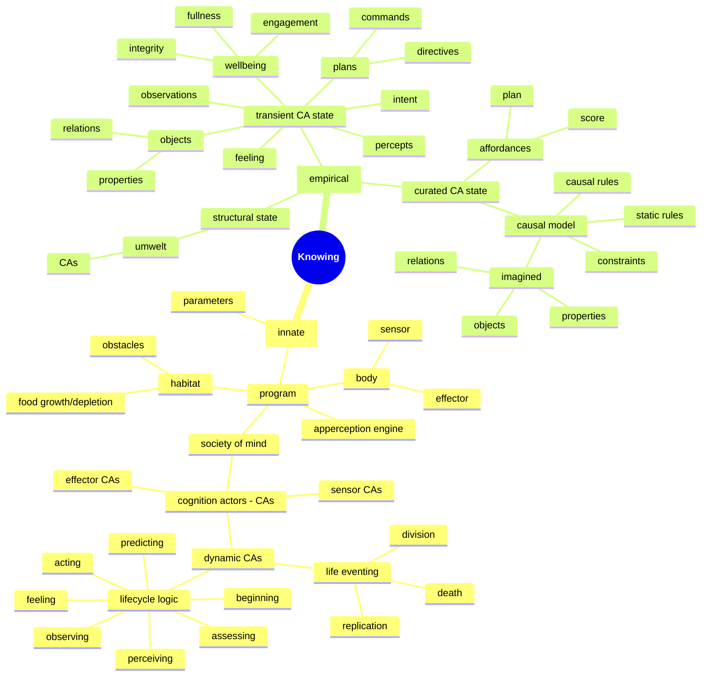

# Mindmap

```mermaid
mindmap
    root ((**Knowing**))
        [innate]
            program
                body
                    sensor
                    effector
                society of mind
                    cognition actors - CAs
                        sensor CAs
                        effector CAs
                        dynamic CAs
                            lifecycle logic
                                beginning
                                predicting
                                observing
                                perceiving
                                feeling
                                acting
                                assessing
                            life eventing
                                replication
                                division
                                death
                apperception engine
                habitat
                    food growth/depletion
                    obstacles
            parameters
        [empirical]
            transient CA state
                objects
                    properties
                    relations
                wellbeing
                    fullness
                    integrity
                    engagement
                feeling
                observations
                percepts
                intent
                plans
                    directives
                    commands
            curated CA state
                affordances
                    plan
                    score
                causal model
                    causal rules
                    static rules
                    constraints
                    imagined 
                        objects
                        properties
                        relations
            structural state
                umwelt
                    CAs
```
