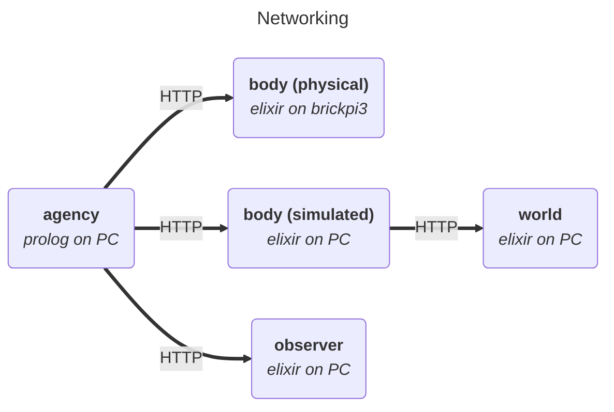
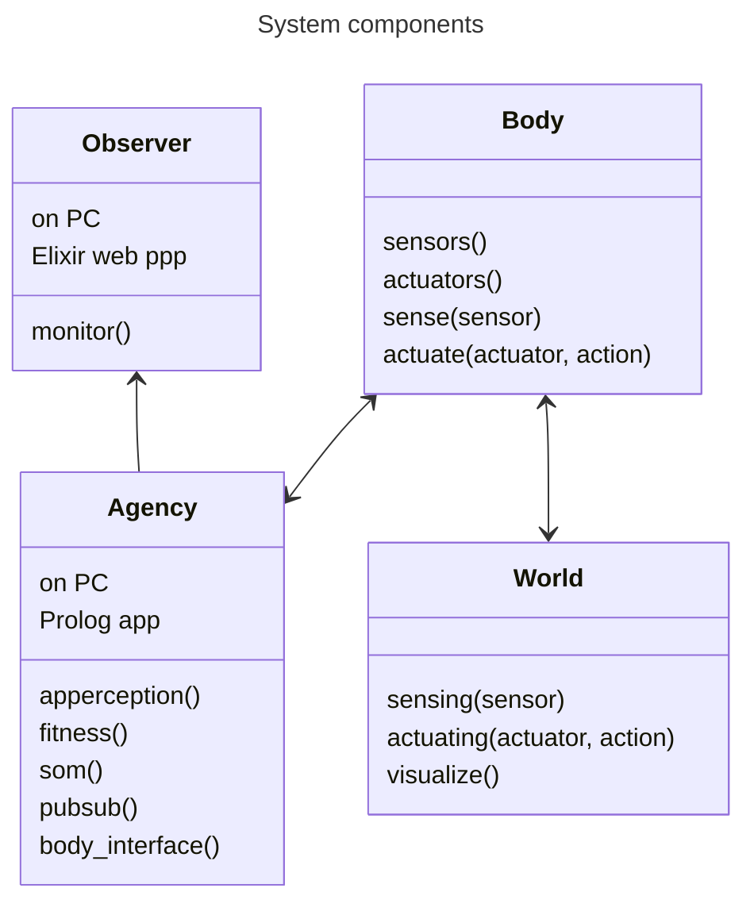
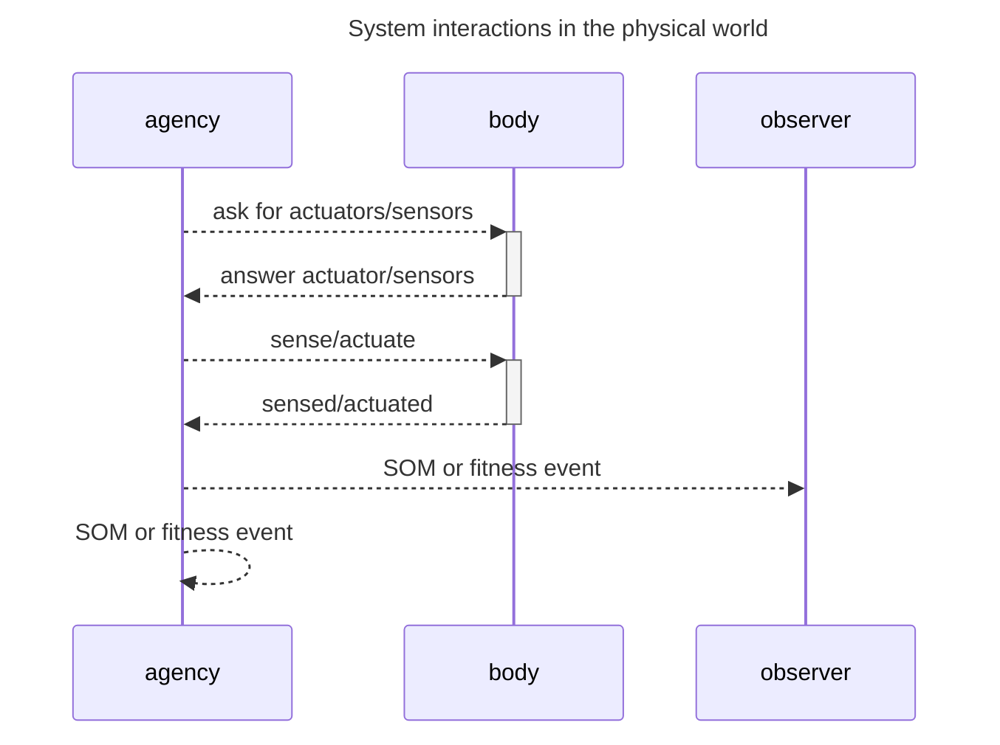
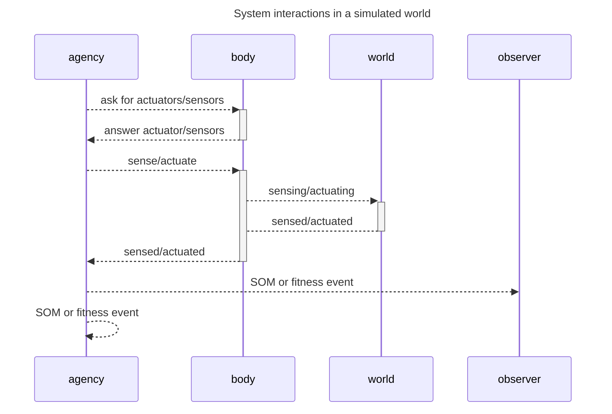

# System

## About

* karma system
  * karma_agency (prolog)
    * App
    * Implements agency functions
      * Apperception
      * Fitness
      * Society of Mind (SOM)
        * Cognition actors
        * Metacognition
  * karma_body (elixir/phoenix)
    * Web app
    * Defines and operates physical or simulated sensors and actuators
      * List actuators and sensors as abstract devices
      * Sense and actuate on request
  * karma_world (elixir/liveview)
    * Web app
    * Provides an environment for simulated sensors and actuators
    * Visualiztion
  * karma_observer (elixir/liveview)
    * Web app
    * Monitoring of an karma_agency

## Status

* karma_agency - **under construction**
  * Operational
    * actor model framework
    * apperception engine
  * To do
    * SOM
    * Fitness and feelings
* karma_body - **under construction**
  * Operational
    * Lego sensors and actuators on a BrickPi3
  * To do
    * Simulated sensors and actuators
* karma_world - **under construction**
* karma_observer - **TO DO**

## Karma system

----

----

----

